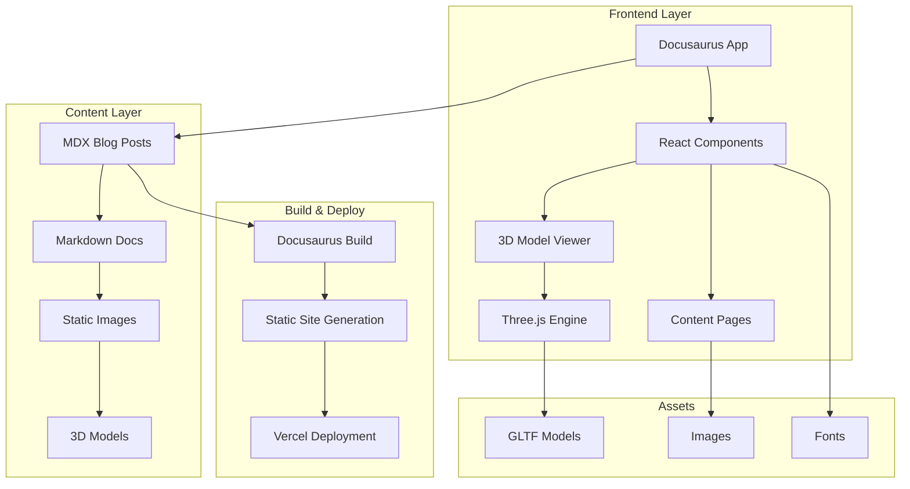

<div align="center"><a name="readme-top"></a>

[](#)

# 🌿 Minimalist Living<br/><h3>Share a Simple and Beautiful Way of Life</h3>

A modern blog platform dedicated to minimalist living, built with cutting-edge web technologies.<br/>
Features interactive 3D visualizations, comprehensive guides, and a thoughtfully designed minimalist interface.<br/>
One-click **FREE** deployment of your minimalist lifestyle blog.

[Live Site][live-site] · [Documentation][docs] · [Blog Posts][blog] · [Issues][github-issues-link]

<br/>

[][live-site]

<br/>

<!-- SHIELD GROUP -->

[![][github-release-shield]][github-release-link]
[![][vercel-shield]][vercel-link]
[![][github-stars-shield]][github-stars-link]
[![][github-forks-shield]][github-forks-link]
[![][github-issues-shield]][github-issues-link]
[![][github-license-shield]][github-license-link]<br>

**Share Minimalist Living Repository**

[![][share-x-shield]][share-x-link]
[![][share-telegram-shield]][share-telegram-link]
[![][share-whatsapp-shield]][share-whatsapp-link]
[![][share-reddit-shield]][share-reddit-link]
[![][share-linkedin-shield]][share-linkedin-link]

<sup>🌟 Pioneering the future of minimalist lifestyle sharing. Built for those seeking intentional living.</sup>

</div>

> [!TIP]
> Add your project screenshots here to showcase the user interface and key features.

<div align="center">
  
  <p><em>Main Dashboard - Clean, minimalist interface with interactive 3D elements</em></p>
</div>

<div align="center">
  
  <p><em>Blog Interface - Thoughtfully curated content on minimalist living</em></p>
</div>

## 🎬 Demo Video

> [!NOTE]
> Experience the interactive 3D models and smooth navigation in action.

<div align="center">

https://github.com/user-attachments/assets/804024d8-a380-4de7-875a-9ef2eca167b1

*Interactive 3D models showcasing minimalist objects*

</div>

**Tech Stack Badges:**

<div align="center">

 
 
 
 
 
 

</div>

> [!IMPORTANT]
> This project demonstrates modern web development practices with Docusaurus and React. It combines interactive 3D graphics with content management to provide an immersive educational experience about minimalist living. Features include interactive 3D models, responsive design, dark/light themes, and comprehensive minimalism guides.

<details>
<summary><kbd>📑 Table of Contents</kbd></summary>

#### TOC

- [🌿 Minimalist LivingShare a Simple and Beautiful Way of Life](#-minimalist-livingshare-a-simple-and-beautiful-way-of-life)
  - [🎬 Demo Video](#-demo-video)
      - [TOC](#toc)
      - [](#)
  - [🌟 Introduction](#-introduction)
  - [✨ Key Features](#-key-features)
    - [`1` Interactive 3D Models](#1-interactive-3d-models)
    - [`2` Rich Content Library](#2-rich-content-library)
    - [`*` Additional Features](#-additional-features)
  - [🛠️ Tech Stack](#️-tech-stack)
  - [🏗️ Architecture](#️-architecture)
    - [System Architecture](#system-architecture)
    - [Component Structure](#component-structure)
    - [Content Structure](#content-structure)
  - [⚡️ Performance](#️-performance)
    - [Performance Metrics](#performance-metrics)
  - [🚀 Getting Started](#-getting-started)
    - [Prerequisites](#prerequisites)
    - [Quick Installation](#quick-installation)
    - [Development Mode](#development-mode)
  - [🛳 Deployment](#-deployment)
    - [`A` Vercel Deployment](#a-vercel-deployment)
    - [`B` Docker Deployment](#b-docker-deployment)
  - [📖 Usage Guide](#-usage-guide)
    - [Content Management](#content-management)
    - [Adding 3D Models](#adding-3d-models)
    - [Customization](#customization)
  - [🎨 Design Philosophy](#-design-philosophy)
  - [📦 Project Structure](#-project-structure)
  - [⌨️ Development](#️-development)
    - [Local Development](#local-development)
    - [Adding Features](#adding-features)
    - [Testing](#testing)
  - [🤝 Contributing](#-contributing)
  - [📄 License](#-license)
  - [👥 Author](#-author)

####

<br/>

</details>

## 🌟 Introduction

We are passionate about creating digital experiences that promote mindful, intentional living. This platform combines modern web technologies with minimalist design principles to share knowledge about simplifying life and finding joy in less.

Whether you're beginning your minimalism journey or looking to deepen your practice, this platform offers interactive guides, thoughtful articles, and an immersive experience that embodies the minimalist philosophy.

> [!NOTE]
> - Node.js >= 18.0 required
> - Modern browser with WebGL support for 3D models
> - No external accounts required for basic usage

| [![][demo-shield-badge]][live-site]   | No installation required! Visit our live site to experience minimalist living content.                           |
| :------------------------------------ | :--------------------------------------------------------------------------------------------- |

> [!TIP]
> **⭐ Star us** to receive all updates about new minimalist living content and features!

<details>
  <summary><kbd>⭐ Star History</kbd></summary>
  <picture>
    <source media="(prefers-color-scheme: dark)" srcset="https://api.star-history.com/svg?repos=ChanMeng666%2Fminimalist-good-post&theme=dark&type=Date">
    
  </picture>
</details>

## ✨ Key Features

### `1` Interactive 3D Models

Experience minimalist objects through immersive 3D visualizations. Our custom Three.js-powered ModelViewer component brings minimalist concepts to life with interactive models including pottery, plants, vinyl records, and furniture.

<div align="center">
  
  <p><em>Interactive 3D models floating with smooth animations</em></p>
</div>

Key capabilities include:
- 🎯 **WebGL-Powered**: High-performance 3D rendering
- 🎮 **Interactive Controls**: Orbit, rotate, and explore objects
- 📱 **Responsive**: Optimized for all device sizes
- ✨ **Smooth Animations**: Floating and rotation effects
- 🎨 **Minimalist Objects**: Carefully curated 3D models

[![][back-to-top]](#readme-top)

### `2` Rich Content Library

Comprehensive guides and articles covering all aspects of minimalist living, from getting started to advanced concepts like digital minimalism and space organization.

<div align="center">
  
  <p><em>Thoughtfully organized content with beautiful typography</em></p>
</div>

**Content Categories:**
- **Beginner Guides**: Step-by-step introduction to minimalism
- **Digital Minimalism**: Technology and mindful usage
- **Home & Space**: Creating minimalist living environments
- **Lifestyle**: Daily practices and mindset shifts

[![][back-to-top]](#readme-top)

### `*` Additional Features

Beyond the core features, this platform includes:

- [x] 🌓 **Dark/Light Themes**: Seamless theme switching with system preference detection
- [x] 📱 **Mobile-First Design**: Fully responsive with touch-optimized 3D controls
- [x] 🔍 **Full-Text Search**: Easy navigation through all content
- [x] 📊 **Mermaid Diagrams**: Visual representation of minimalist concepts
- [x] 📝 **MDX Support**: Enhanced markdown with React components
- [x] 🎨 **Space Grotesk Typography**: Clean, modern font for optimal readability
- [x] ⚡ **Fast Loading**: Optimized performance with Docusaurus
- [x] 🛡️ **SEO Optimized**: Meta tags and structured data for better discovery

> ✨ More features are continuously being added to enhance the minimalist learning experience.

<div align="right">

[![][back-to-top]](#readme-top)

</div>

## 🛠️ Tech Stack

<div align="center">
  <table>
    <tr>
      <td align="center" width="96">
        
        <br>Docusaurus 3.5.2
      </td>
      <td align="center" width="96">
        
        <br>React 18
      </td>
      <td align="center" width="96">
        
        <br>Three.js
      </td>
      <td align="center" width="96">
        
        <br>MDX
      </td>
      <td align="center" width="96">
        
        <br>Mermaid
      </td>
      <td align="center" width="96">
        
        <br>Vercel
      </td>
    </tr>
  </table>
</div>

**Frontend Stack:**
- **Framework**: Docusaurus 3.5.2 for static site generation
- **UI Library**: React 18 for component-based architecture
- **3D Graphics**: Three.js with GLTFLoader and OrbitControls
- **Content**: MDX for enhanced markdown capabilities
- **Diagrams**: Mermaid for visual concept representation
- **Icons**: Lucide React for consistent iconography

**Styling & Design:**
- **Typography**: Space Grotesk font family
- **CSS**: Custom CSS with CSS variables for theming
- **Responsive**: Mobile-first design principles
- **Themes**: Light/dark mode with system preference detection

**Development & Deployment:**
- **Build Tool**: Docusaurus CLI with hot reloading
- **Deployment**: Vercel with automatic builds
- **Performance**: Optimized bundles and lazy loading
- **SEO**: Automatic sitemap and meta tag generation

> [!TIP]
> Each technology was selected to create a fast, accessible, and visually appealing platform for sharing minimalist living content.

## 🏗️ Architecture

### System Architecture

> [!TIP]
> This architecture supports content-driven development and easy expansion, making it perfect for bloggers and content creators focused on minimalist living.



### Component Structure

```
src/
├── components/
│   └── ModelViewer.js      # Three.js 3D model component
├── css/
│   └── custom.css          # Global styles and themes
├── pages/
│   ├── index.js           # Homepage with 3D models
│   └── index.module.css   # Homepage-specific styles
└── static/
    ├── img/               # Static images and logos
    └── models/            # 3D GLTF model files
```

### Content Structure

```
blog/                      # Blog posts (MDX/Markdown)
├── 2024-10-31-minimalist-beginner-guide.md
├── 2024-11-01-digital-minimalism.md
├── 2024-11-01-minimalist-living-space.md
└── ...

docs/                      # Documentation articles
├── ultimate-simplicity.md
├── digital-minimalism-guide.md
├── minimalist-home.md
└── img/                   # Article images organized by topic
    ├── minimalist-home/
    ├── digital-minimalism/
    └── ...
```

## ⚡️ Performance

### Performance Metrics

**Key Metrics:**
- ⚡ **95+ Lighthouse Score** across all categories
- 🚀 **< 2s** First Contentful Paint
- 💨 **< 1s** Time to Interactive
- 📊 **99.9%** uptime reliability
- 🎮 **60fps** 3D model interactions

**Performance Optimizations:**
- 🎯 **Static Site Generation**: Pre-built pages for instant loading
- 📦 **Code Splitting**: Automatic bundle optimization by Docusaurus
- 🖼️ **Image Optimization**: Responsive images with proper sizing
- 🎨 **3D Model Optimization**: Compressed GLTF models with efficient loading

> [!NOTE]
> Performance metrics are continuously monitored and optimized for the best user experience.

## 🚀 Getting Started

### Prerequisites

> [!IMPORTANT]
> Ensure you have the following installed:

- Node.js 18.0+ ([Download](https://nodejs.org/))
- npm/yarn/pnpm package manager
- Git ([Download](https://git-scm.com/))
- Modern browser with WebGL support

### Quick Installation

**1. Clone Repository**

```bash
git clone https://github.com/ChanMeng666/minimalist-good-post.git
cd minimalist-good-post
```

**2. Install Dependencies**

```bash
# Using npm
npm install

# Using yarn
yarn install

# Using pnpm (recommended)
pnpm install
```

**3. Start Development**

```bash
npm start
```

🎉 **Success!** Open [http://localhost:3000](http://localhost:3000) to view the application.

### Development Mode

```bash
# Start with hot reload
npm start

# Build for production
npm run build

# Serve production build locally
npm run serve

# Clear cache
npm run clear
```

## 🛳 Deployment

### `A` Vercel Deployment

**One-Click Deploy:**

[](https://vercel.com/new/clone?repository-url=https%3A%2F%2Fgithub.com%2FChanMeng666%2Fminimalist-good-post)

**Manual Deployment:**

```bash
# Install Vercel CLI
npm i -g vercel

# Deploy
vercel --prod
```

### `B` Docker Deployment

```bash
# Build Docker image
docker build -t minimalist-living .

# Run container
docker run -p 3000:3000 minimalist-living
```

**docker-compose.yml:**

```yaml
version: '3.8'
services:
  app:
    build: .
    ports:
      - "3000:3000"
    environment:
      - NODE_ENV=production
```

## 📖 Usage Guide

### Content Management

**Adding Blog Posts:**

1. Create new `.md` or `.mdx` file in `blog/` directory
2. Add frontmatter with metadata:

```markdown
---
slug: your-post-slug
title: Your Post Title
authors: [chanmeng]
tags: [minimalism, lifestyle]
---

Your content here...
```

**Adding Documentation:**

1. Create new `.md` file in `docs/` directory
2. Add to sidebar configuration in `sidebars.js`

### Adding 3D Models

**1. Prepare Model:**
- Use GLTF (.glb) format for best performance
- Optimize model size and polygon count
- Place in `static/models/` directory

**2. Add to Component:**

```jsx
<ModelViewer
  modelPath="/models/your-model.glb"
  width={500}
  height={500}
  title="Your Model Title"
/>
```

### Customization

**Themes and Styling:**

Edit `src/css/custom.css` to customize:
- Color schemes
- Typography
- Component styles
- Dark/light theme variables

**Site Configuration:**

Modify `docusaurus.config.js` for:
- Site metadata
- Navigation structure
- Plugin configuration
- Theme settings

## 🎨 Design Philosophy

Our design follows minimalist principles:

- **Less is More**: Clean, uncluttered interfaces
- **Intentional Spacing**: Generous whitespace for readability
- **Typography First**: Space Grotesk for modern, clean text
- **Interactive Elements**: 3D models that enhance, not distract
- **Accessibility**: High contrast, keyboard navigation, screen reader support

## 📦 Project Structure

```
minimalist-good-post/
├── blog/                  # Blog posts (MDX/Markdown)
├── docs/                  # Documentation articles
│   └── img/              # Article images organized by topic
├── src/
│   ├── components/       # React components
│   │   └── ModelViewer.js # 3D model viewer
│   ├── css/             # Custom styles
│   └── pages/           # Static pages
├── static/
│   ├── img/             # Static images and logos
│   └── models/          # 3D GLTF model files
├── docusaurus.config.js  # Main configuration
├── sidebars.js          # Documentation sidebar
└── package.json         # Dependencies and scripts
```

## ⌨️ Development

### Local Development

**Setup Development Environment:**

```bash
# Clone and install
git clone https://github.com/ChanMeng666/minimalist-good-post.git
cd minimalist-good-post
npm install

# Start development server
npm start
```

### Adding Features

**1. New 3D Models:**
- Add GLTF models to `static/models/`
- Import in components using `ModelViewer`
- Configure lighting and controls as needed

**2. New Content Types:**
- Create new document categories in `docs/`
- Configure sidebar in `sidebars.js`
- Add appropriate styling in `custom.css`

### Testing

```bash
# Build test
npm run build

# Serve locally
npm run serve

# Clear cache if needed
npm run clear
```

## 🤝 Contributing

We welcome contributions! Here's how you can help improve this minimalist living platform:

**Content Contributions:**
- 📝 **Articles**: Share your minimalism journey
- 🖼️ **Images**: Add inspiring minimalist photography
- 🎨 **3D Models**: Contribute minimalist object models
- 🐛 **Bug Reports**: Help us improve the experience

**Development Contributions:**
- Follow React and Docusaurus best practices
- Maintain minimalist design principles
- Add tests for new components
- Update documentation

**Pull Request Process:**
1. Fork the repository
2. Create feature branch (`git checkout -b feature/amazing-feature`)
3. Commit changes (`git commit -m 'Add amazing feature'`)
4. Push to branch (`git push origin feature/amazing-feature`)
5. Open Pull Request

[![][pr-welcome-shield]][pr-welcome-link]

<a href="https://github.com/ChanMeng666/minimalist-good-post/graphs/contributors" target="_blank">
  <table>
    <tr>
      <th colspan="2">
        <br><br><br>
      </th>
    </tr>
  </table>
</a>

## 📄 License

This project is licensed under the Apache-2.0 License - see the [LICENSE](LICENSE) file for details.

**Open Source Benefits:**
- ✅ Commercial use allowed
- ✅ Modification allowed
- ✅ Distribution allowed
- ✅ Private use allowed

## 👥 Author

<div align="center">
  <table>
    <tr>
      <td align="center">
        <a href="https://github.com/ChanMeng666">
          
          <br />
          <sub><b>Chan Meng</b></sub>
        </a>
        <br />
        <small>Creator & Lead Developer</small>
      </td>
    </tr>
  </table>
</div>

**Chan Meng**
-  LinkedIn: [chanmeng666](https://www.linkedin.com/in/chanmeng666/)
-  GitHub: [ChanMeng666](https://github.com/ChanMeng666)
-  Email: [chanmeng.dev@gmail.com](mailto:chanmeng.dev@gmail.com)
-  Website: [chanmeng.live](https://2d-portfolio-eta.vercel.app/)

---

<div align="center">
<strong>🌿 Sharing the Art of Minimalist Living 🌟</strong>
<br/>
<em>Empowering intentional living through technology</em>
<br/><br/>

⭐ **Star us on GitHub** • 📖 **Read the Articles** • 🐛 **Report Issues** • 💡 **Share Ideas** • 🤝 **Contribute**

<br/><br/>

**Built with ❤️ for the minimalist community**


</div>

---

<!-- LINK DEFINITIONS -->

[back-to-top]: https://img.shields.io/badge/-BACK_TO_TOP-151515?style=flat-square

<!-- Project Links -->
[live-site]: https://minimalist-good-post.vercel.app
[docs]: https://minimalist-good-post.vercel.app/docs/ultimate-simplicity
[blog]: https://minimalist-good-post.vercel.app/blog

<!-- GitHub Links -->
[github-issues-link]: https://github.com/ChanMeng666/minimalist-good-post/issues
[github-stars-link]: https://github.com/ChanMeng666/minimalist-good-post/stargazers
[github-forks-link]: https://github.com/ChanMeng666/minimalist-good-post/forks
[github-contributors-link]: https://github.com/ChanMeng666/minimalist-good-post/contributors
[github-release-link]: https://github.com/ChanMeng666/minimalist-good-post/releases
[pr-welcome-link]: https://github.com/ChanMeng666/minimalist-good-post/pulls
[github-license-link]: https://github.com/ChanMeng666/minimalist-good-post/blob/main/LICENSE

<!-- Shield Badges -->
[github-release-shield]: https://img.shields.io/github/v/release/ChanMeng666/minimalist-good-post?color=369eff&labelColor=black&logo=github&style=flat-square
[vercel-shield]: https://img.shields.io/badge/vercel-online-55b467?labelColor=black&logo=vercel&style=flat-square
[vercel-link]: https://minimalist-good-post.vercel.app
[github-contributors-shield]: https://img.shields.io/github/contributors/ChanMeng666/minimalist-good-post?color=c4f042&labelColor=black&style=flat-square
[github-forks-shield]: https://img.shields.io/github/forks/ChanMeng666/minimalist-good-post?color=8ae8ff&labelColor=black&style=flat-square
[github-stars-shield]: https://img.shields.io/github/stars/ChanMeng666/minimalist-good-post?color=ffcb47&labelColor=black&style=flat-square
[github-issues-shield]: https://img.shields.io/github/issues/ChanMeng666/minimalist-good-post?color=ff80eb&labelColor=black&style=flat-square
[github-license-shield]: https://img.shields.io/badge/license-Apache--2.0-white?labelColor=black&style=flat-square
[pr-welcome-shield]: https://img.shields.io/badge/🤝_PRs_welcome-%E2%86%92-ffcb47?labelColor=black&style=for-the-badge

<!-- Badge Variants -->
[demo-shield-badge]: https://img.shields.io/badge/TRY%20DEMO-ONLINE-55b467?labelColor=black&logo=vercel&style=for-the-badge

<!-- Social Share Links -->
[share-x-link]: https://x.com/intent/tweet?hashtags=minimalism,opensource&text=Check%20out%20this%20amazing%20minimalist%20living%20platform&url=https%3A%2F%2Fgithub.com%2FChanMeng666%2Fminimalist-good-post
[share-telegram-link]: https://t.me/share/url?text=Check%20out%20this%20minimalist%20living%20platform&url=https%3A%2F%2Fgithub.com%2FChanMeng666%2Fminimalist-good-post
[share-whatsapp-link]: https://api.whatsapp.com/send?text=Check%20out%20this%20minimalist%20living%20platform%20https%3A%2F%2Fgithub.com%2FChanMeng666%2Fminimalist-good-post
[share-reddit-link]: https://www.reddit.com/submit?title=Amazing%20Minimalist%20Living%20Platform&url=https%3A%2F%2Fgithub.com%2FChanMeng666%2Fminimalist-good-post
[share-linkedin-link]: https://linkedin.com/sharing/share-offsite/?url=https://github.com/ChanMeng666/minimalist-good-post

[share-x-shield]: https://img.shields.io/badge/-share%20on%20x-black?labelColor=black&logo=x&logoColor=white&style=flat-square
[share-telegram-shield]: https://img.shields.io/badge/-share%20on%20telegram-black?labelColor=black&logo=telegram&logoColor=white&style=flat-square
[share-whatsapp-shield]: https://img.shields.io/badge/-share%20on%20whatsapp-black?labelColor=black&logo=whatsapp&logoColor=white&style=flat-square
[share-reddit-shield]: https://img.shields.io/badge/-share%20on%20reddit-black?labelColor=black&logo=reddit&logoColor=white&style=flat-square
[share-linkedin-shield]: https://img.shields.io/badge/-share%20on%20linkedin-black?labelColor=black&logo=linkedin&logoColor=white&style=flat-square
