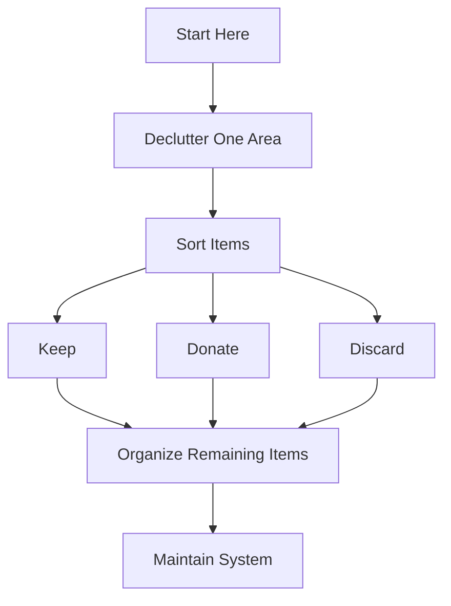

import Tabs from '@theme/Tabs';
import TabItem from '@theme/TabItem';

# Getting Started with Minimalism

We often hear about minimalism as a lifestyle choice, but what does it really mean to live minimally? Let's explore how to simplify your life and focus on what truly matters.

<!--truncate-->

## Understanding Minimalism 🎯

<Tabs>
    <TabItem value="what" label="What is it?" default>

        Minimalism isn't about living with nothing – it's about living with just enough. At its core, minimalism is intentionally promoting what we value most and removing everything that distracts us from it.

    </TabItem>
    <TabItem value="why" label="Why Choose It?">

        * **Mental Clarity** - Less clutter, clearer mind
        * **Time Freedom** - More time for what matters
        * **Financial Health** - Reduced unnecessary spending

    </TabItem>
    <TabItem value="who" label="Who is it for?">

        Minimalism is for anyone seeking:
        * More intentional living
        * Reduced stress
        * Greater focus in life

    </TabItem>
</Tabs>

## Quick Start Guide 🚀

:::tip Key Principle
Start small, progress gradually, and remember it's a journey, not a race.
:::

### 1. Initial Assessment

#### What to Keep
* Items used in the last 3 months
* Meaningful sentimental items
* Essential tools and documents

#### What to Remove
* Duplicates
* Broken items
* Unused items from past year

### 2. Practical Steps



### 3. Digital Minimalism

```python
# Simple file organization script
def organize_files(directory):
    """Basic file organization script"""
    categories = {
        'documents': ['.pdf', '.doc', '.txt'],
        'images': ['.jpg', '.png', '.gif'],
        'audio': ['.mp3', '.wav', '.flac']
    }

    # Example usage of categories
    for category in categories:
        print(f"Organizing {category}...")
```

## Common Challenges & Solutions 💡

### Dealing with Sentimental Items

:::caution Remember
Memories reside in you, not in things.
:::

**Solutions:**
* 📸 Take photos before letting go
* 🎁 Keep one representative item
* 💭 Focus on the memory, not the object

### Progress Tracker

:::info Track Your Journey
Use this simple checklist:

- [ ] Completed initial assessment
- [ ] Decluttered one room
- [ ] Organized digital files
- [ ] Created maintenance routine
:::

## Daily Practices 📅

| Time Frame | Action Items | Expected Outcome |
|------------|--------------|------------------|
| Morning | Quick 5-min tidy | Fresh start to day |
| Weekly | One area deep clean | Maintained space |
| Monthly | Full home review | Sustained minimalism |

## Advanced Tips 🌟

### The One In, Two Out Rule
1. For every new item, remove two
2. Helps reduce overall possessions
3. Forces thoughtful acquisition

### The 30-Day List
1. Write down desired purchases
2. Wait 30 days before buying
3. Most desires fade naturally

### Organization by Category
1. Group similar items together
2. Easier to see duplicates
3. Better for decision making

## Resources

:::note Final Thoughts
Remember: The goal isn't to own less, but to make room for more of what matters.
:::
