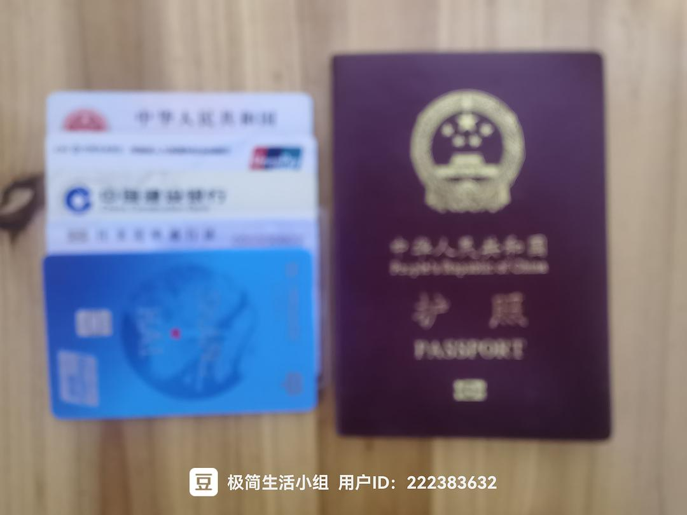
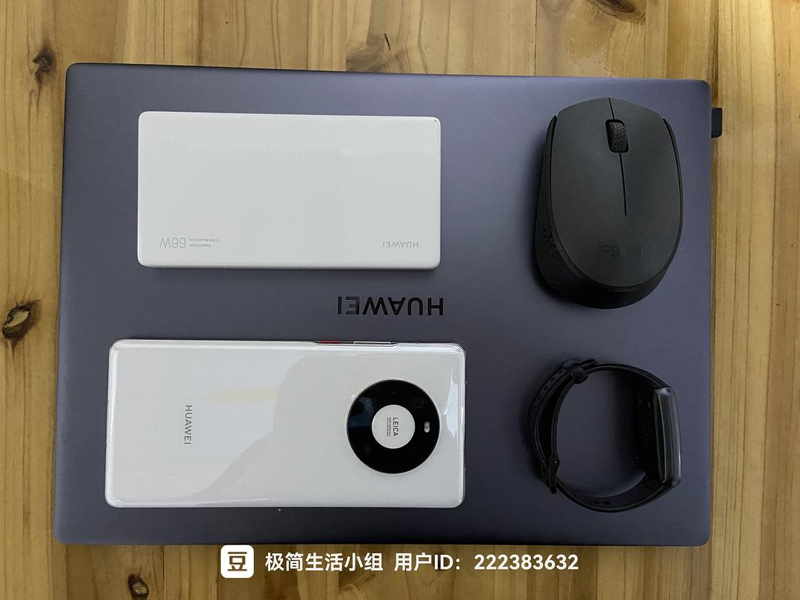
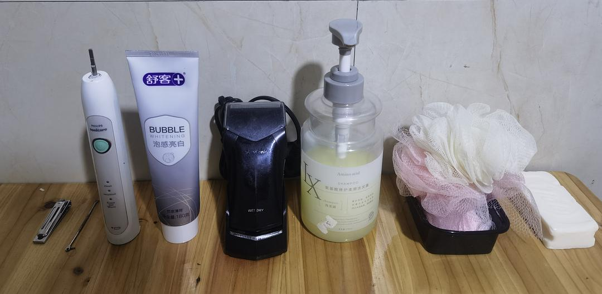
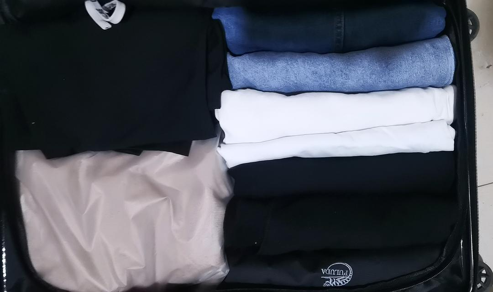
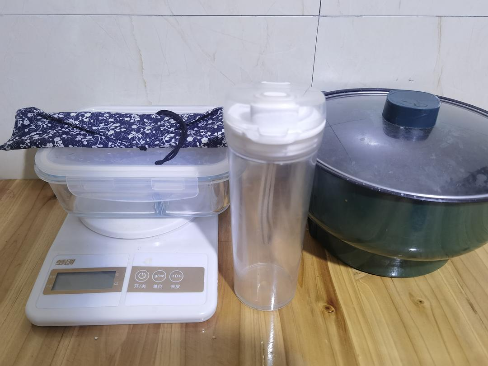
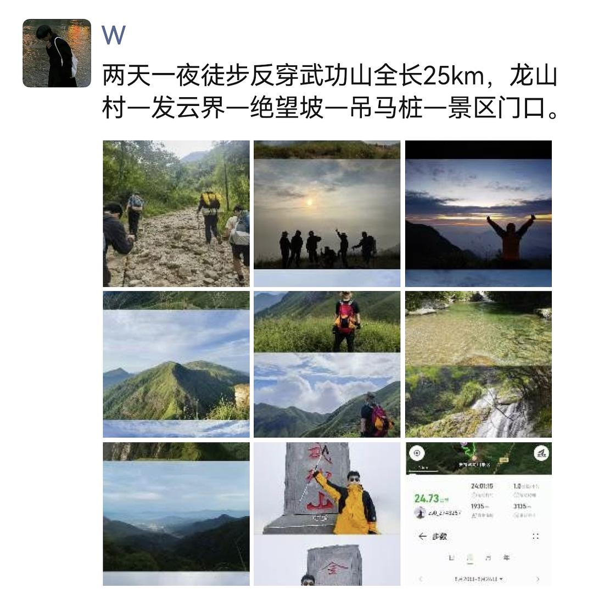
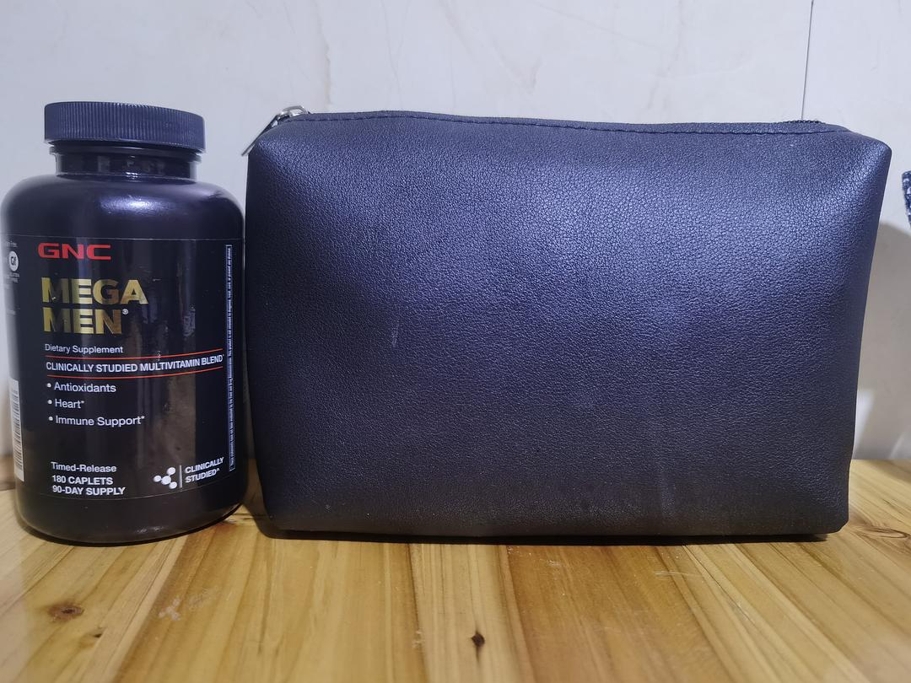

# My 78 Possessions After One Year of Minimalism

*Originally written by Ziyi from Henan on October 24, 2023*

## Complete Inventory by Category

### Essential Documents & Cards
- ID card
- Construction Bank card
- Social security card
- Passport
- Exit-Entry Permit for Hong Kong and Macau

:::note
All cards and documents are kept in one compact card holder.
:::

### Digital Devices
- Laptop
- Smartphone
- Smart band
- Mouse
- Power bank

:::info
These items fully meet daily needs. Previously owned a tablet and monitor but sold them as part of minimizing process.
:::

### Personal Hygiene System
- Nail clipper
- Ear pick
- Toothbrush
- Toothpaste
- Razor
- Shampoo
- Bath sponge
- Wash towel
- Laundry soap
- Body soap
- Water basin
- Clothes hangers

:::note
The water basin and clothes hangers, though larger items, are essential. All hygiene items fit into one toiletry bag.
:::

### Clothing System
- 6 pairs of pants
- 3 pairs of shoes
- 4 pairs of underwear
- 2 pairs of shorts
- 1 pair of slippers
- 4 pairs of socks
- 5 t-shirts
- 2 jackets
- 2 hoodies

### Kitchen System
- Chopsticks
- Spoon
- Water cup
- Electric cooking pot
- Food container
- Kitchen scale

:::info
The electric cooking pot is versatile enough for frying, steaming, and boiling - perfect for one person's cooking needs.
:::

### Hiking & Camping Gear
- Rain jacket
- Headlamp
- Trekking poles
- Backpack
- Emergency blanket
- Arm sleeves
- Buff/neck gaiter
- Sun protection clothing
- Tent
- Egg crate mat
- Sleeping bag

:::note
These items were gradually acquired after starting hiking as a long-term hobby.
:::

### First Aid & Medicine Kit
- Face masks
- Alcohol pads
- Band-aids
- Multivitamins
- Coenzyme Q10
- Amoxicillin
- Compound cold medicine
- Tretinoin cream
- Metronidazole gel
- Zinc gluconate tablets
- Vitamin E

## Photo Gallery

:::info
The following images showcase how 78 possessions can be organized efficiently and minimally.
:::

