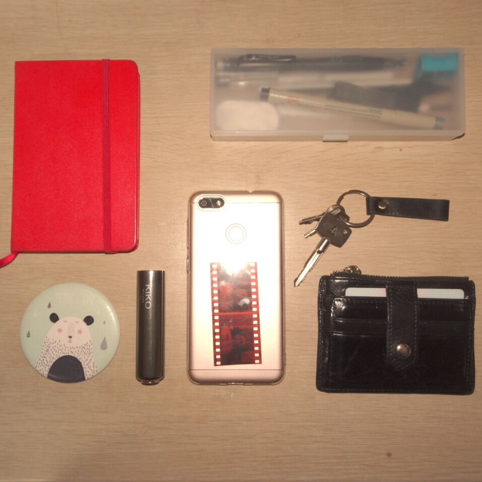
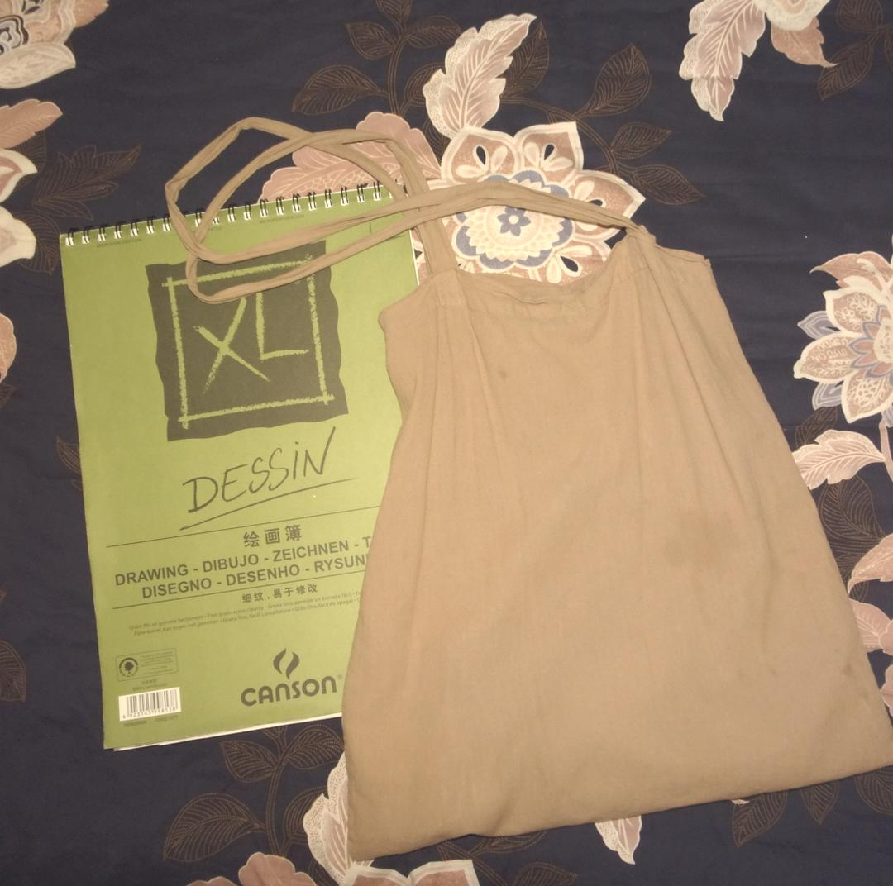
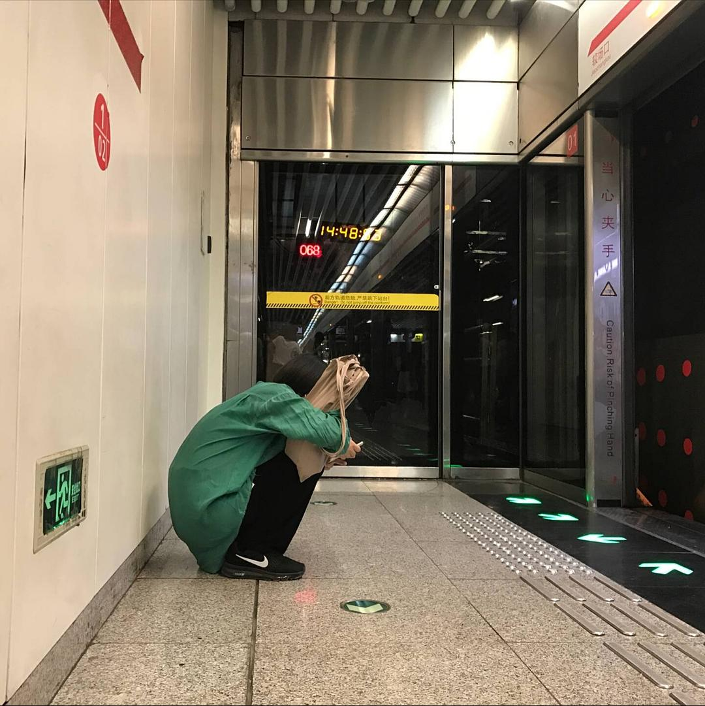
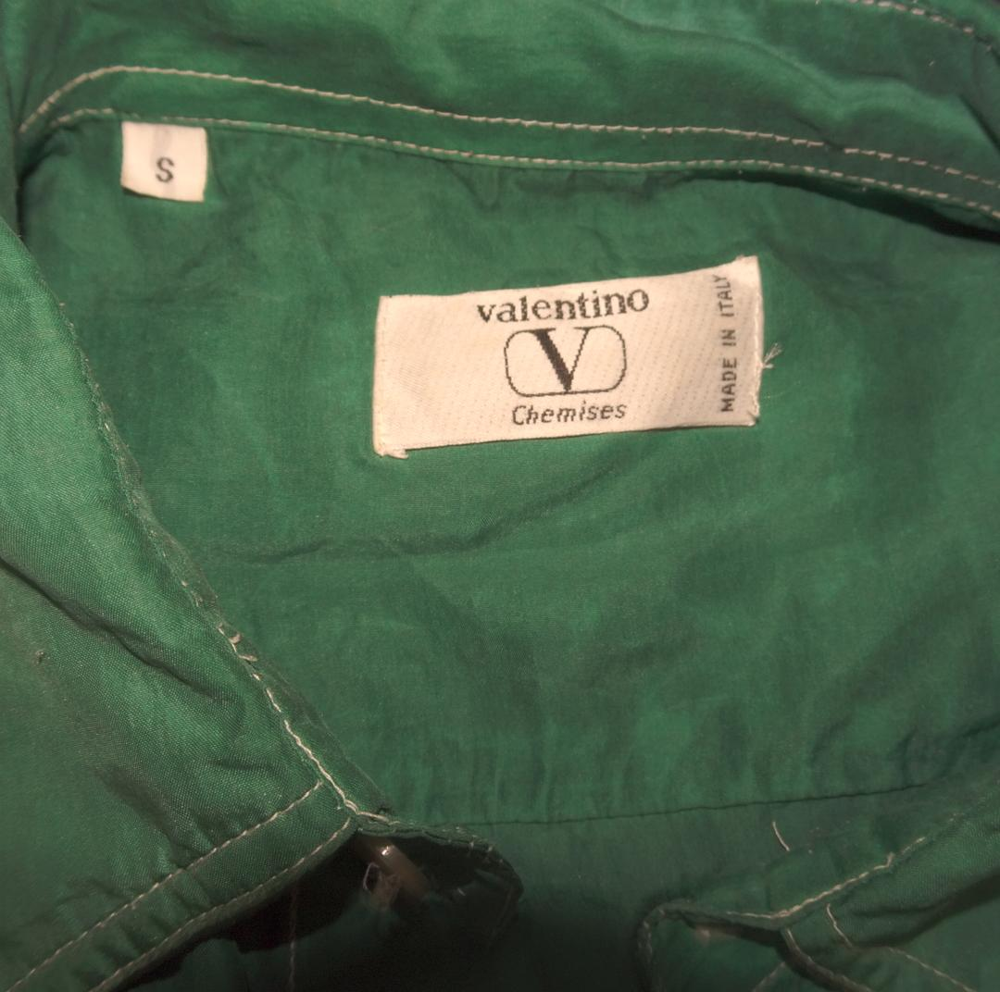
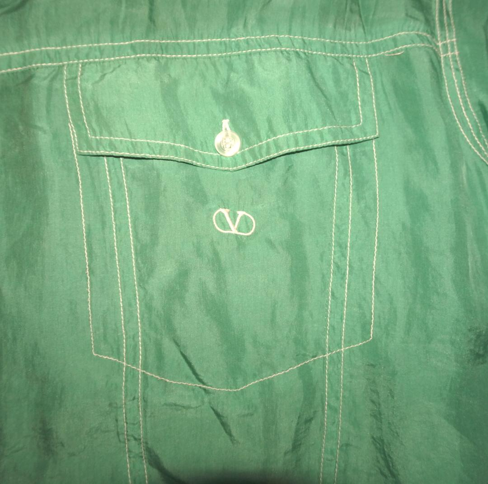
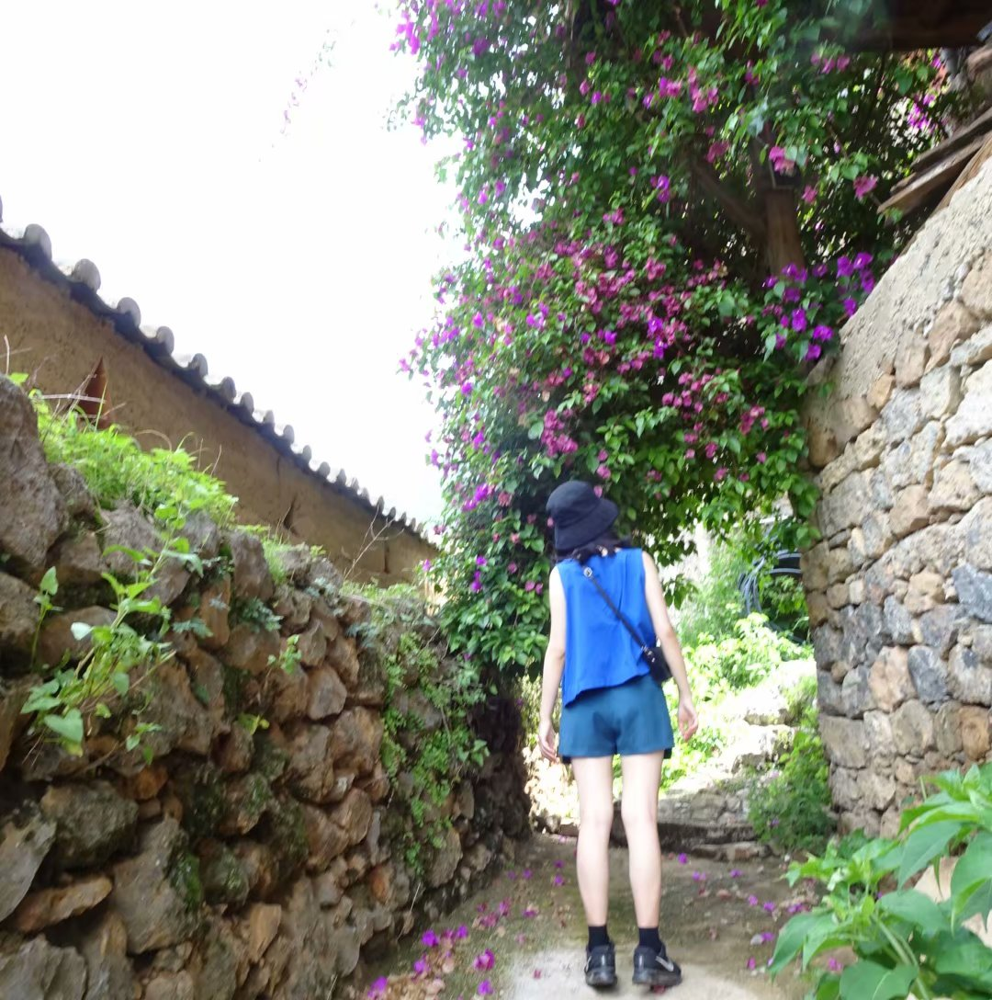
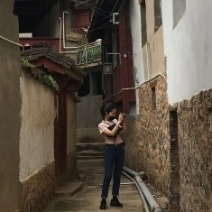
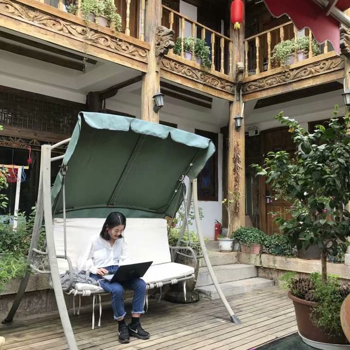
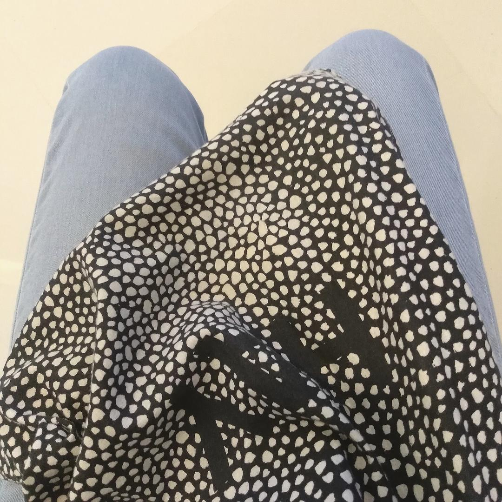

# Minimalist Life as an Architecture Student

*Originally written by Sylvia, a third-year architecture student, September 15, 2017*

## Introduction

As a third-year architecture student at a Chinese art academy, I've been practicing minimalism for quite some time. The biggest benefit I've experienced is the overall lightness in both body and mind.

:::info
Key benefits of minimalist living as an architecture student:
- Better space management
- Reduced physical and mental clutter
- Improved focus on essential tasks
- Enhanced productivity
  :::

## Academic Life Management

### Project Storage
Before embracing minimalism, my dorm room was cluttered with drawings and models. Now:
- Keep only digital copies of work
- Focus on portfolio preparation
- View assignments as learning checkpoints rather than permanent artifacts

### Textbook Strategy
- Return professional course books home after completion
- Discard general course materials post-exam
- Use Kindle for most reading
- Subscribe to Amazon's monthly e-book service (¥12/month)

:::note
For specialized architecture books like portfolios and visual collections, I maintain physical copies, but all other books are digital.
:::

## Living Space Organization

### Dorm Room Philosophy
- Resist the urge to create extra storage spaces
- Limited storage means controlled purchasing
- Under-bed storage contains only:
    - One pair of flip-flops
    - One pair of black leather shoes
    - One pair of black sneakers
    - One pair of white canvas shoes

### Daily Essentials for Class
- Phone
- Keys
- Lipstick
- Card holder
- Notebook
- Small mirror
- Pencil case
- Sketching pad
- MUJI tote bag

:::info
Practical tip: During project submission weeks, makeup is simplified to just lipstick for a quick refresh between long work sessions.
:::

## Wardrobe Management

Current wardrobe consists of 30 pieces (excluding sleepwear and underwear):
- Quality over quantity approach
- Focus on versatile pieces
- Example: A three-year-old silk blouse that works for multiple seasons

:::note
Clothing care tip: Hand wash quality pieces with shampoo suds in a basin. Good clothes deserve proper care.
:::

## Digital Organization

### Computer Setup
- High-performance desktop for architecture software (3DS Max, CAD, PS, AI)
- External hard drive for portability
- Computer contains only essential software
- All files categorized and stored on external drive:
    - Architecture references
    - Personal works
    - Photos
    - Videos

### Document Management
- Important receipts preserved
- Non-essential documents digitized
- Handwritten notes for personal reflection and creativity

## Health and Wellness

Recent updates:
- Regular running routine
- Height: 163cm
- Weight maintained at 48kg through mindful eating
- Focus on fresh foods
- Limited snacking
- Digital note-taking using Evernote

## Travel Experience

Recent field trip to Yunnan mountains:
- Single backpack approach
- Essential clothing that mix and match
- Versatile jeans as a staple
- Comfortable sneakers
- Foldable tote bag for convenience

## Photo Gallery

