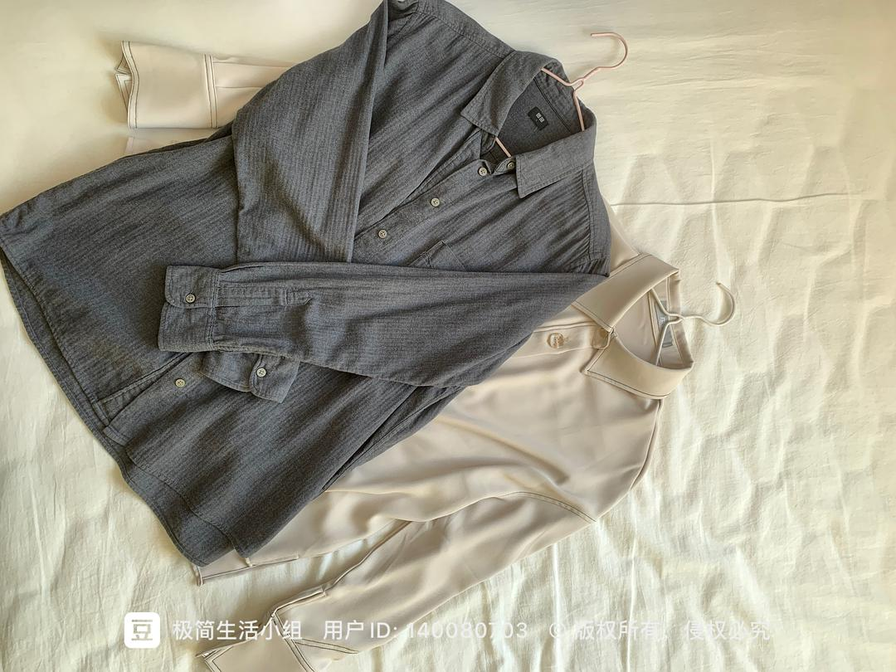

# Complete Inventory (Updated Feb 14, 2023)

*Originally written by Free from Beijing on October 18, 2022*

## Technology & Electronics

### Computing Devices
- Laptop with accessories:
    - Charger
    - Mouse
    - Headphones
    - Stand

:::note Personal Reflection
Previously didn't own a personal computer, using company equipment for work. Bought an affordable Windows laptop for job hunting and exam preparation. While I prefer MacBooks (had an Air but sold it due to low usage), still searching for the right balance between preference and practicality.
:::

### Reading & Study Tools
- PocketBook e-reader with charger
  *(Previously owned Kindle but sold due to low usage)*
- Scientific calculator (for finance certification exams)
- iPhone with:
    - Two pairs of earphones (one new)
    - Lightning adapter
    - Two charging cables

## Documents & Bedding
- Two document folders:
    - Personal certificates
    - Medical records and warranties
- Bedding set:
    - Comforter with cover
    - Bed sheet
    - Pillow

## Clothing Inventory

### Outerwear
1. Heavy down jacket
    - Mid-length
    - 5 years old
    - Considering replacement (too heavy for Beijing winters)
2. Light down jacket
    - High utility
    - Versatile for layering
3. Windbreaker
4. Sweatshirt jacket

### Tops
- 2 dress shirts (versatile for layering)
- 3 long-sleeve T-shirts
- Multiple short-sleeve T-shirts
- Base layer shirts

### Bottoms
- 3 pairs of long pants
  *(including one worn jeans planned for disposal)*
- 1 pair of shorts

### Sun Protection
- UV protection jacket
- Sun hat *(considering disposal - impractical)*

### Sleepwear & Undergarments
- Winter thermal set
- Socks
- UV protection sleeves
- Underwear sets

## Bags & Accessories
- Small black bag (purchased)
- Various promotional bags
- Looking for computer backpack recommendations

## Footwear
- Nike sneakers (slightly tight, considering replacement)
- Planning to buy shoes in-store going forward

## Kitchen & Dining
1. Electric kettle (to be disposed)
2. Small electric cooker (gift, mainly for eggs)
3. Dining items:
    - Yellow PP containers (microwave-safe)
    - Two glass bowls (considering disposing of one)

## Daily Necessities
1. Towels
2. Water container
3. Umbrellas:
    - Large black rain umbrella
    - Dual-use blue umbrella
    - Compact sun umbrella

:::tip Minimalist Approach
Most items are gifts or promotional items. Planning to reassess all possessions before moving.
:::

## Consumables
- Medications
- Batteries
- Writing instruments
  *(Detailed inventory pending post-move update)*

## Photo Gallery

:::info
The following images document my complete possession inventory as of February 2023.
:::

