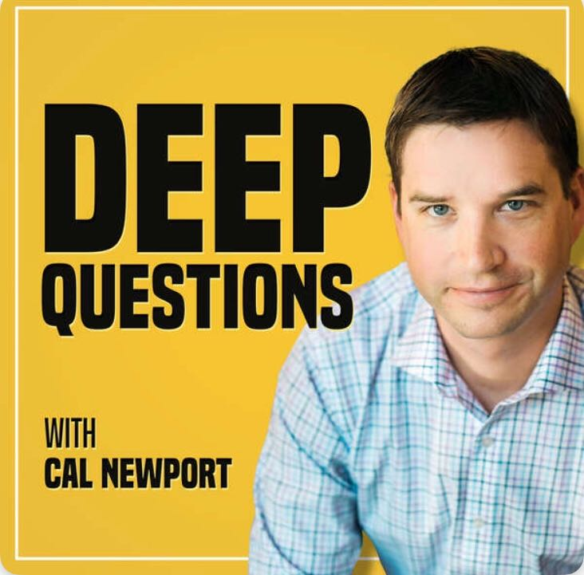

# Deep Questions #7: How to Build a Deep Life

*Originally written by Fangzhou on July 12, 2020*

## Introduction

Q: How can I get my life back on track? I often feel lazy, unmotivated, overthink things, and feel lost.

A: The deep life framework can help you find yourself again. It consists of five core elements:
- Craft
- Constitution
- Community
- Contemplation
- Competency

## The Deep Life Framework

### 1. Craft

:::info
Key aspects of craft:
- Essential for making a living
- A means to impact the world
- Lifelong importance

As emphasized in "So Good They Can't Ignore You," greater mastery of your craft leads to greater career control. The key is finding satisfaction in the process of skill development itself.
:::

### 2. Constitution

Physical and mental health deserve equal attention:
- Monitor diet and exercise
- Take a radical approach
- Push beyond conventional boundaries

:::note
Being slightly radical in health practices:
- Signals serious commitment
- Generates genuine enjoyment
- Builds confidence
- Develops patience
- Creates satisfaction
  :::

### 3. Community

Community connects you with others:
- Focus on being useful to your community/family/school/city
- Don't focus on making others your friends
- Build connections through contribution and sacrifice

:::important
Deep human connections:
- Based on service and sacrifice
- Fundamental to human nature
- Essential for survival and growth
- Provide unexpected rewards
  Note: Social media manipulates this basic human need for connection
  :::

### 4. Contemplation

Developing your life philosophy through deep thinking:
- An unavoidable part of life
- Must establish personal philosophy
- Guides thoughts and actions

Methods include:
- Taking on challenging tasks
- Reading difficult books
- Engaging with diverse perspectives
- Deepening intellectual roots

### 5. Competency

:::info
Building self-efficacy:
- Belief in your ability to impact the world
- Confidence in creating positive change
- Trust in personal agency
  :::

## Implementation Plan

Cal Newport's recommended approach:
- Dedicate five months to building your deep life
- Focus on one element each month
- Continue previous months' practices
- Build progressively

:::note
Remember: Building a deep life is a gradual process. Focus on one element at a time while maintaining previous improvements.
:::
