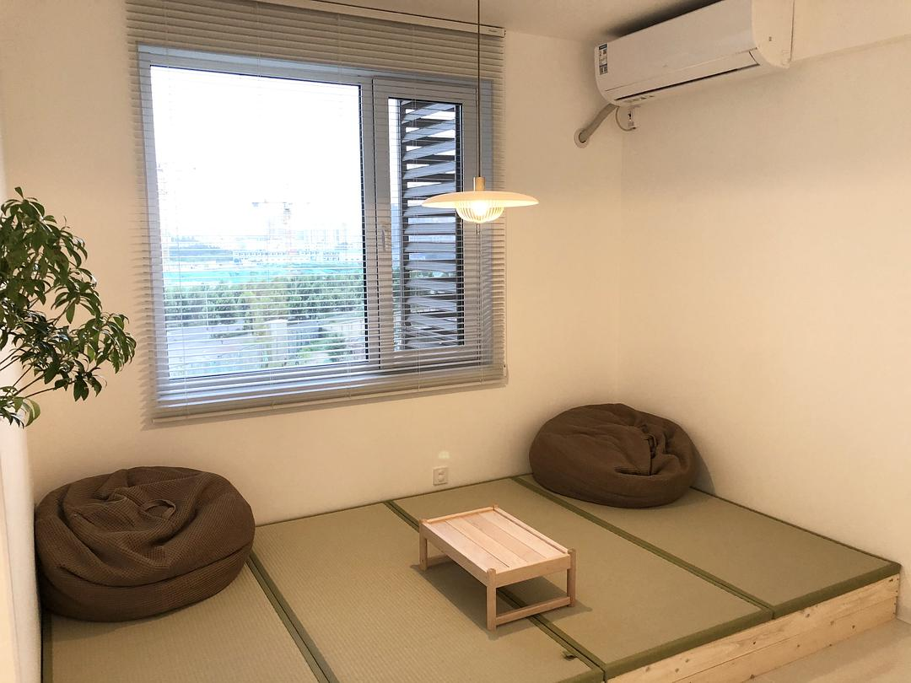
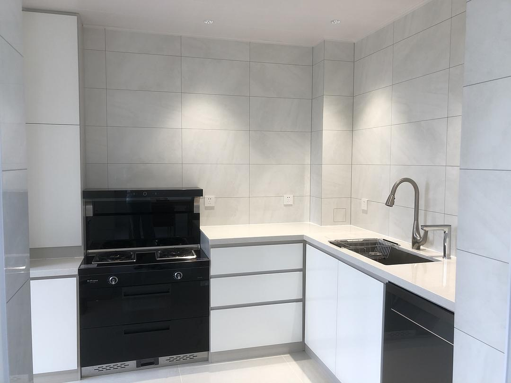
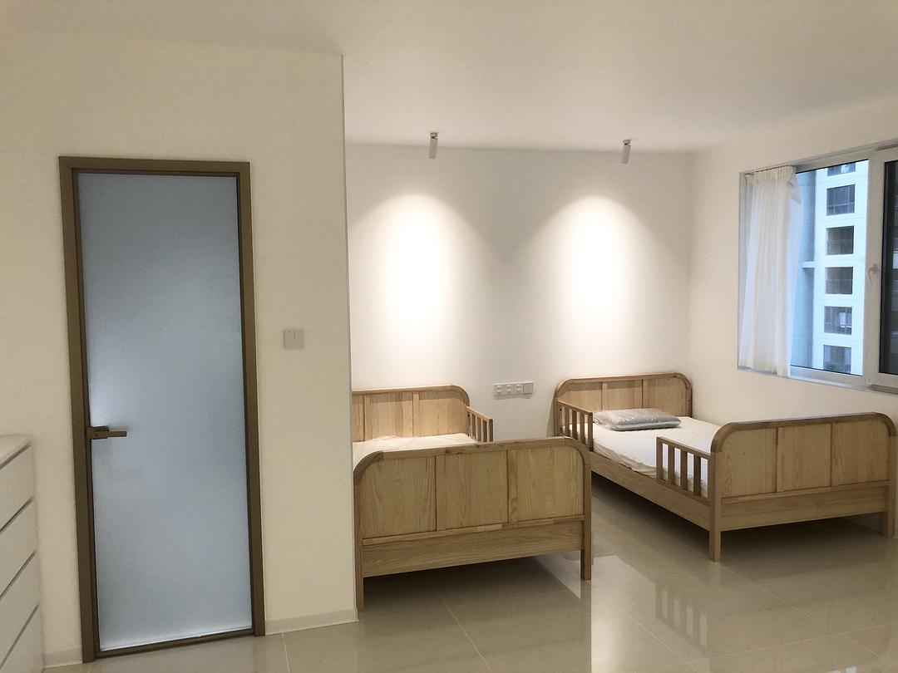

# A Family of Four's Minimalist Home

*Originally written by Ru on October 18, 2021*

## Home Overview

:::note Space Details
- Living space: 140m²
- Original layout: 4 bedrooms
- Current layout: 2 bedrooms (walls removed for open space)
- Residents: Parents and two children
  :::

## Design Philosophy

Our home embodies our minimalist ideals:
- Only essential clothing and daily items
- No unnecessary objects
- Everything has its purpose and place
- Clean, open spaces for children to play freely

## Room-by-Room Tour

### Living Area
- No traditional sofa or coffee table
- No TV (using projector on white wall)
- Open space for children's activities
- Large mirror to enhance spaciousness
- Raised platform with tatami mats for relaxation

:::tip Family Time
The open layout allows our children to skate and play freely while we can enjoy family movie nights using the projector.
:::

### Storage Solutions

**Walk-in Closet (2.5m length)**
- Metal wall-mounted racks
- Curtain instead of doors
- Divided equally between parents
- Four drawers containing:
    1. Accessories (hats, scarves, underwear)
    2. Bed linens
    3. Pajamas
    4. Winter down jackets

### Children's Space
- IKEA drawer units (one per child)
- Bookshelf for toys and personal items
- Two single beds
- Open play area

### Kitchen
- No upper cabinets for airy feel
- Integrated dishwasher
- All-in-one cooking range
- Clean countertops (everything stored inside)
- White cabinets for minimalist look

### Utility Areas
- Converted guest bathroom into laundry room
- Added dryer to eliminate balcony drying
- Balcony converted to relaxation space with:
    - White curtains
    - Large rocking chair
    - Growing garlic sprouts

## Photo Gallery

:::info
The following images showcase our minimalist family home after three months of residence.
:::

