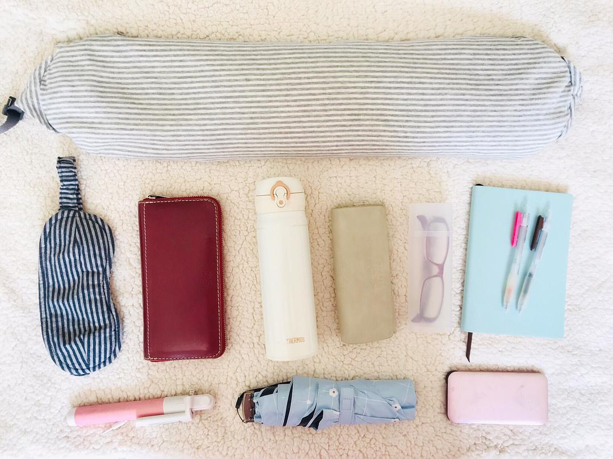
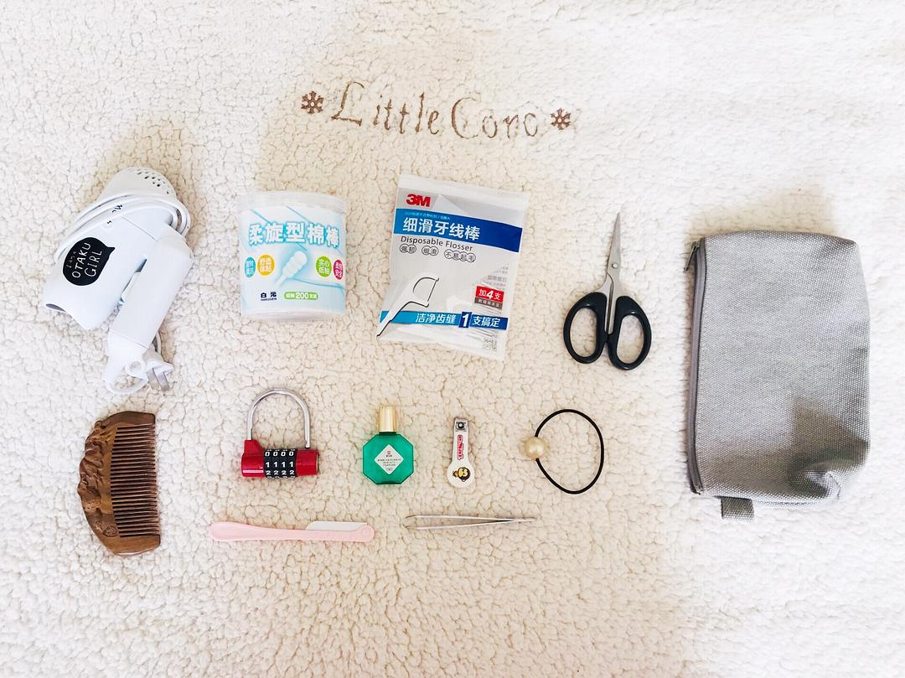

# Minimalist Practice: How Many Daily Items Does a Woman Really Need?

*Originally written by Maple Sugar on April 3, 2019*

## Introduction

After practicing minimalism for a year, I've discarded about 70% of my possessions, leaving just 50 essential items. Surprisingly, this hasn't negatively impacted my life at all - instead, it has helped shape my life into exactly what I wanted it to be.

:::note
Key achievement:
- Started with numerous possessions
- Reduced to 50 essential items
- All items fit in one backpack
- Can live comfortably anywhere
  :::

## Complete Essential Items List

### Electronic Devices
1. Laptop
2. Kindle
3. Mobile phone
4. Chargers for all three devices
5. Two pairs of earphones (large and small)

### Personal Care

#### Skincare Basics
- Facial cleanser
- Toner
- Serum
- Moisturizer
- Face cream
- Eye cream

#### Optional Makeup (for going out)
- Sunscreen
- BB cushion
- Eyebrow powder
- Lip balm
- Lipstick
- Perfume
- Makeup remover

#### Daily Hygiene
- Toothbrush
- Toothpaste
- Portable toothbrush holder
- Shampoo
- Shower gel
- Laundry soap
- Towel

:::info
Personal care items are sized to last approximately two months
:::

### Miscellaneous Items

#### Travel Essentials
- U-shaped pillow
- Thermos
- Wallet
- Selfie stick
- Umbrella
- Eye mask
- Notebook
- Pen
- Sunglasses
- Regular glasses
- Power bank

#### Personal Tools
- Hair dryer
- Cotton swabs
- Eye drops
- Dental floss
- Scissors
- Nail clipper
- Eyebrow razor
- Small tweezers
- Hair ties
- Comb
- Combination lock
- Miscellaneous bag

## Reflection

:::important
Key realizations:
1. These 50 items are sufficient for a comfortable life
2. Everything fits in one backpack
3. This setup enables easy relocation
4. Minimalism doesn't mean sacrifice
   :::

## Photo Gallery

:::note
The photos demonstrate how these 50 essential items can be efficiently organized and packed, proving that a minimalist lifestyle is both practical and liberating.
:::
