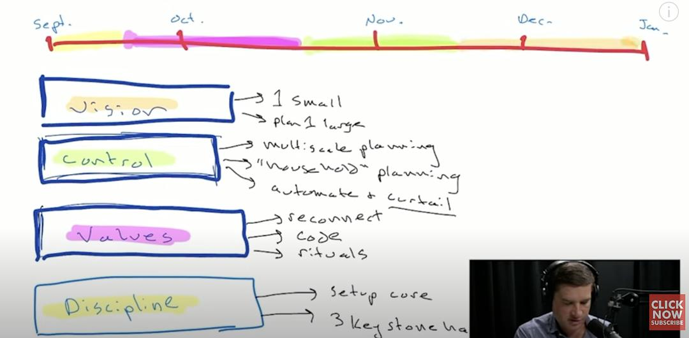

# Cal Newport's Guide: How to Reinvent Your Life in 4 Months

*Originally summarized by Fangzhou from Sichuan on September 3, 2023*

## Common Challenges

During digital declutter, many people face questions like:
- How to handle boredom without digital devices?
- How to organize work and life more effectively?
- How to identify truly valuable activities?

## The Four-Month Framework

### 1. Discipline (2 weeks)

:::info
Key actions:
- Create a core tracking document/folder
- Establish three keystone habits:
    1. Professional life
    2. Health and fitness
    3. Personal wellbeing
- Track progress consistently
  :::

### 2. Values (4 weeks)

:::important
Essential steps:
- Reconnect with moral intuition through meaningful books/movies
- Create a personal code as life guidance
- Establish regular rituals to reinforce values:
    - Meditation practice
    - Volunteer work
    - Other meaningful activities
      :::

### 3. Control (4 weeks)

Focus on multi-scale planning:
- Professional planning:
    - Quarterly goals
    - Daily time blocks
- Personal responsibilities:
    - Household tasks
    - Non-work commitments
- Process optimization:
    - Task automation
    - Schedule streamlining

### 4. Vision (6 weeks)

:::note
Vision implementation:
- Focus on specific life areas for transformation
- Set clear, concrete outcomes
- Example: Becoming a serious film enthusiast
    - Setting up home theater
    - Establishing viewing routines
      :::

## Implementation Timeline

## Additional Insights

### Creativity and Deep Work
- Combine structured work with occasional unstructured sessions
- Experiment with different approaches during deep work

### Mental Health Considerations
:::important
For those dealing with depression:
1. Seek professional help first
2. Use framework as supplementary support
3. Focus on building regular discipline
4. Establish control gradually
5. Create meaningful accomplishments
   :::

### Upcoming Work
Cal Newport's new book "Slow Productivity":
- Promotes humanistic approach to productivity
- Emphasizes work-life balance
- Focuses on sustainable achievement

### Recommended Reading
Humanistic productivity books:
- "The 4-Hour Workweek"
- "Essentialism"
- "How to Do Nothing"
- "Do Nothing"
- "4,000 Weeks"

:::note
Remember: This framework is designed to start in September, aligning with the new year's timeframe for natural transition and goal-setting.
:::
