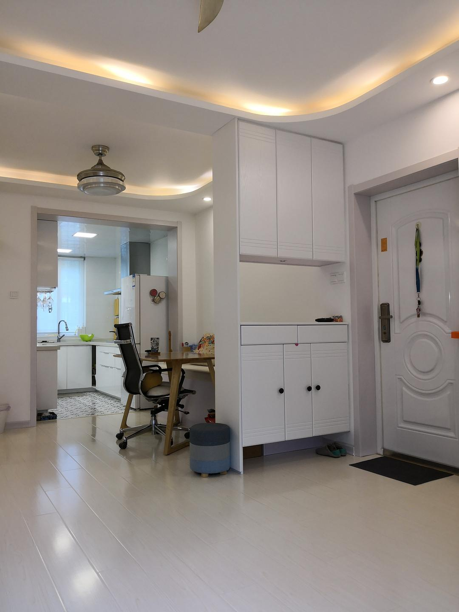

# Home Evolution: Four Years Later

*Originally posted by Mountain Colors on May 5, 2020*
*Updated July 2022*

## Living Space Transformation

:::note Timeline
This collection documents the evolution of a living space from initial setup through nearly four years of mindful adjustments and improvements.
:::

### 2022 Updates

**Master Bedroom**
The latest updates showcase the refined bedroom space, demonstrating how the room has evolved to balance aesthetics with functionality.

**Living Room**
The July 2022 update reveals the current state of the living area, showing how the space has matured over time.

## Photo Gallery

:::info
The following images document the home's evolution, with special emphasis on the 2022 updates to the master bedroom and living areas.
:::

:::tip
Comments are welcome for specific areas you'd like to see updated or detailed in future posts.
:::
