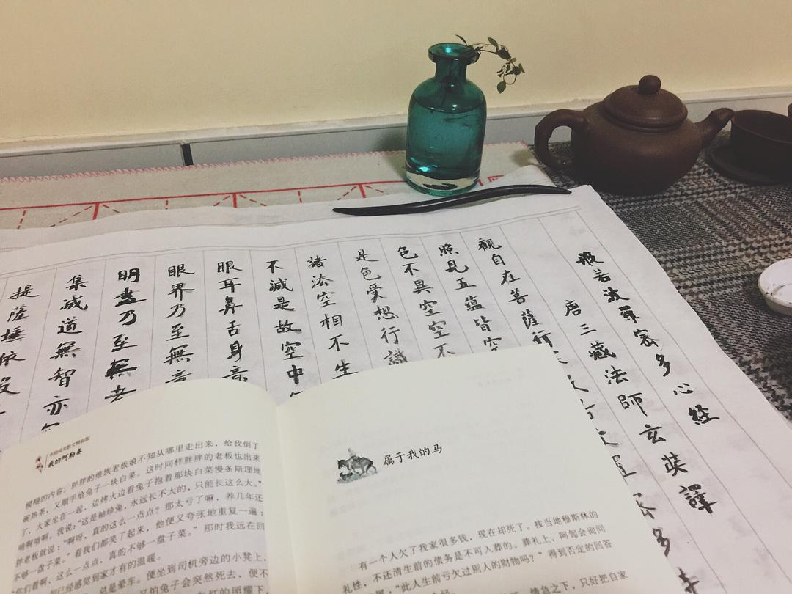
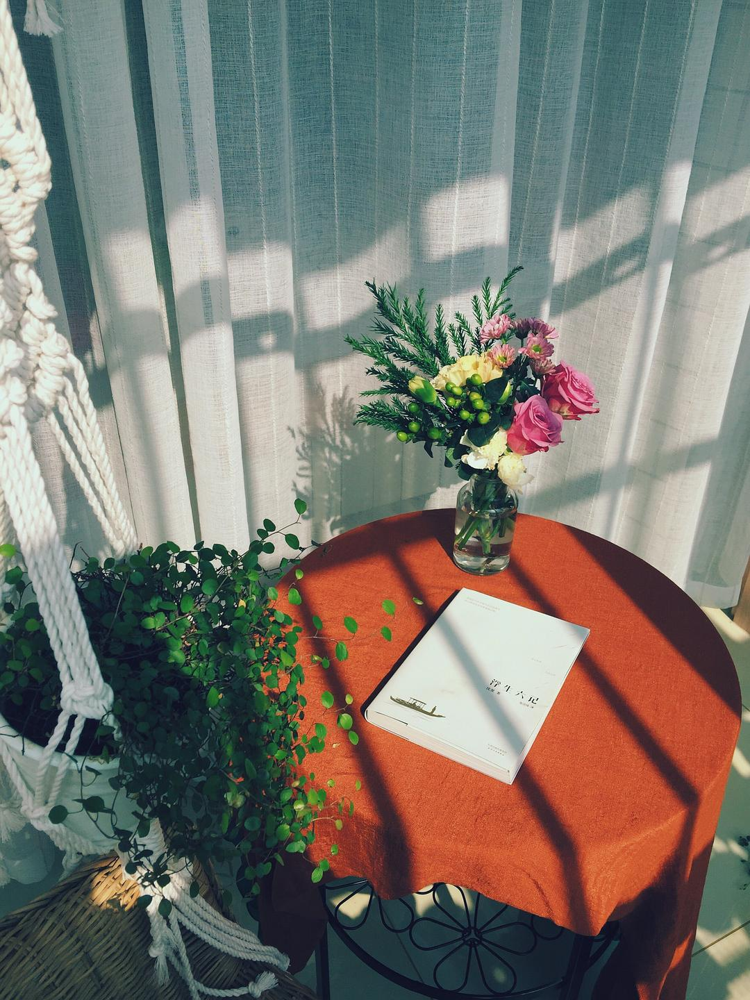

# My Life Journey: 2017-2022

*Originally started by Poetry Two Lines on June 13, 2017*

## Life Updates Through the Years

### 2022 Update
:::note September 25, 2022
Life has changed dramatically with two children (ages 4 and 2). While managing their clothes and toys remains a challenge, we still maintain minimalist principles where possible. I'm gradually regaining my energy and working to return to my previous organized lifestyle.
:::

### 2018 Update
:::note March 5, 2018
The core organization remains unchanged - everything has its place. Though I've added some new items, the basic minimalist principles continue to guide my choices.
:::

## Daily Life Documentation (2017)

### Weekly Rituals
- Fresh flowers every week
- Reading practice
- Calligraphy practice

### Home Organization

**Living Room**
- Removed coffee table for more floor space
- Light-colored sofa cover
- Floor carpet for relaxation

**Bedrooms**
- Master bedroom: Minimalist setup without headboard or bedside tables
- Simple IKEA chair for necessities
- Secondary bedroom with simple curtains
- Additional tatami room

**Kitchen & Storage**
- Organized drawers with plenty of empty space
- Regular cleaning routine
- Minimal kitchenware

### Personal Care
**Skincare & Bath Products**
- Avène thermal water spray
- Sulwhasoo toner and lotion
- Propolis mouthwash
- All-in-one shampoo
- Regular shampoo, conditioner, and body wash
- Separate laundry detergents for clothes and bedding
- Bar soaps for general use and delicates

:::tip Minimalist Approach
I keep skincare products under the sink and only take them out when needed. This creates a cleaner, more organized space compared to having bottles everywhere.
:::

## Photo Gallery

:::info
The following images document my minimalist journey from 2017 to 2022, showing both the evolution of spaces and consistent organizational principles.
:::

