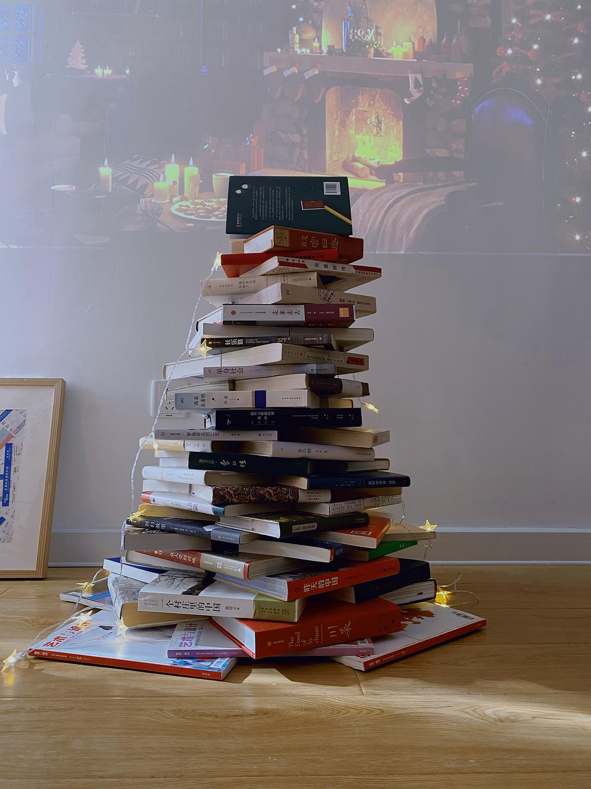

# A Single Woman's Minimalist Home

*Originally written by Echo on June 7, 2022*

## My Minimalist Journey

I began my minimalist journey in 2018, and started documenting my daily minimalist life in this group in 2019. In 2020, after completing my home renovation, I briefly deviated from minimalism while purchasing furniture and home essentials. Now, after living here for over two years, everything in my home is either deeply cherished or essential.

## Personal Philosophy on Minimalism

:::note Definition
My definition of minimalism isn't about having an empty space, but rather:
- Cherishing what I own
- Following the "one item per purpose" rule
- Avoiding hoarding
- Buying the best quality within my means
- Maximizing the lifespan of possessions
  :::

### Balancing Minimalism with Joy

I don't apply minimalist principles to:
- Books
- Personal hobbies

:::tip Personal Perspective
The essence of minimalism is to bring joy to one's life. If minimizing hobbies and interests leads to unhappiness, it defeats the purpose of minimalism.
:::

## Home Highlights

1. **Bookshelf**
    - The most "cluttered" area in my home
    - Intentionally kept this way as it brings joy

2. **Living Room Centerpieces**
    - Beloved green sofa
    - Collection of Sanyu's paintings

:::info Design Philosophy
Each item in my home represents a conscious choice, balancing minimalism with personal meaning and aesthetic value.
:::

## Photo Gallery

:::info
The following images showcase my minimalist living space where functionality meets personal style.
:::

