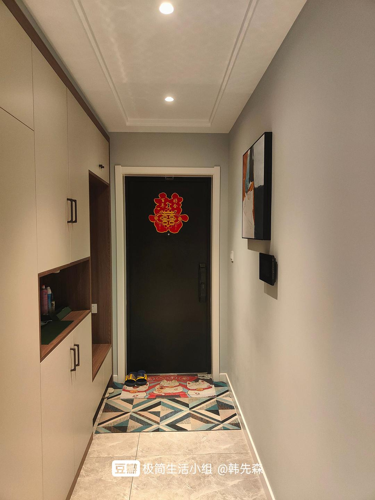
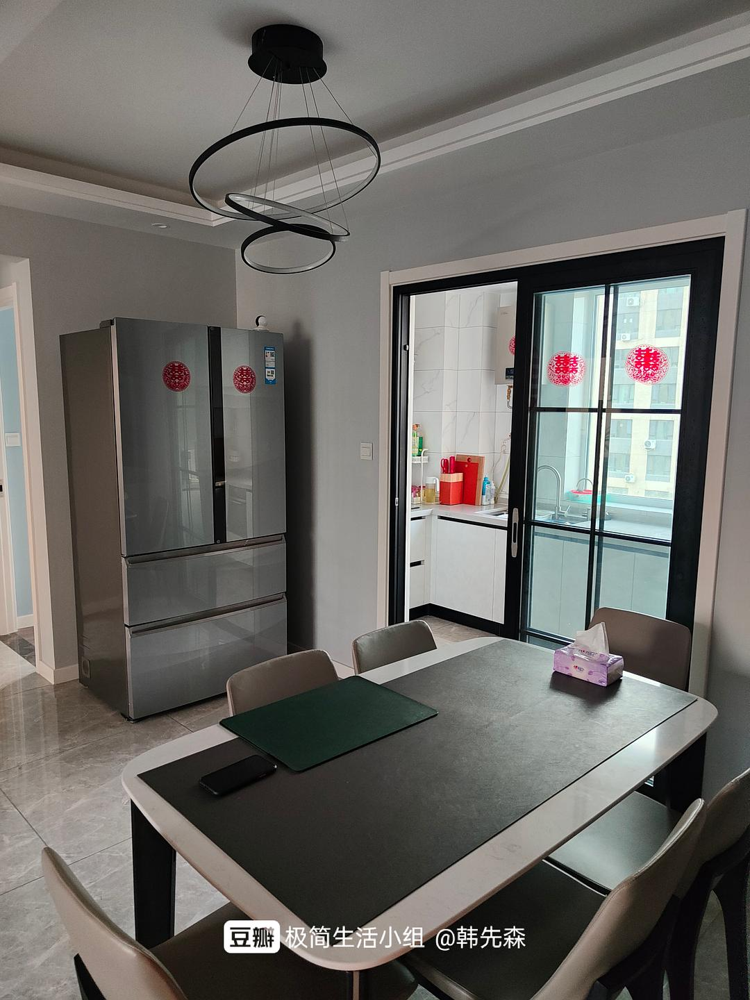
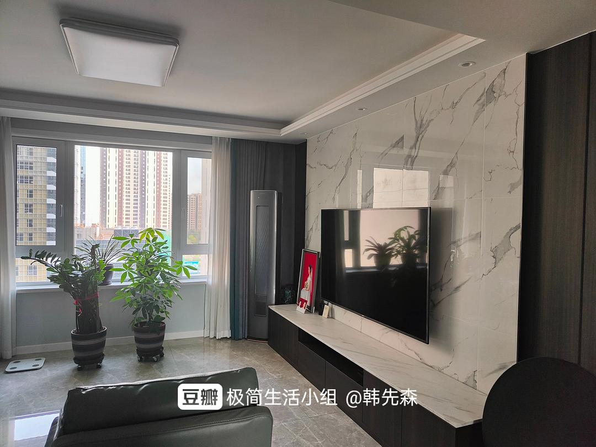
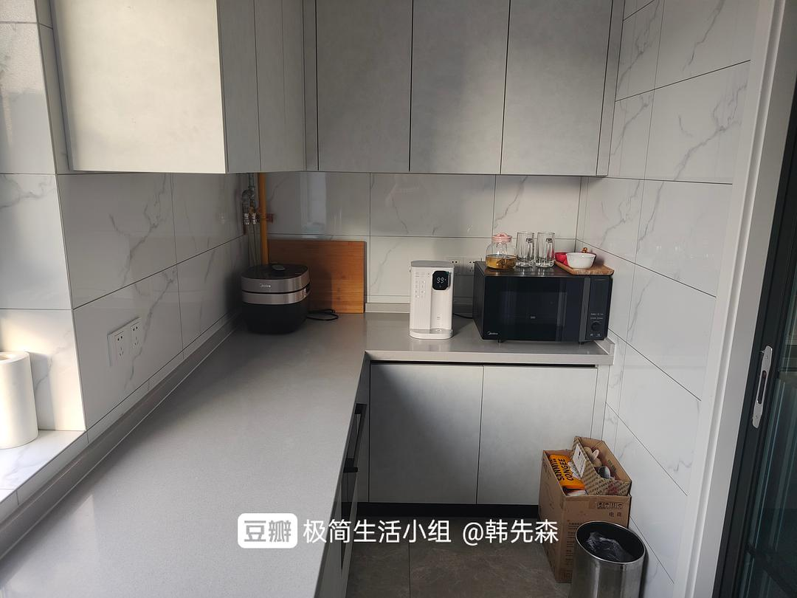
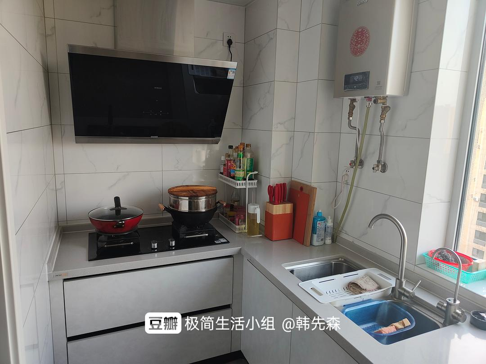
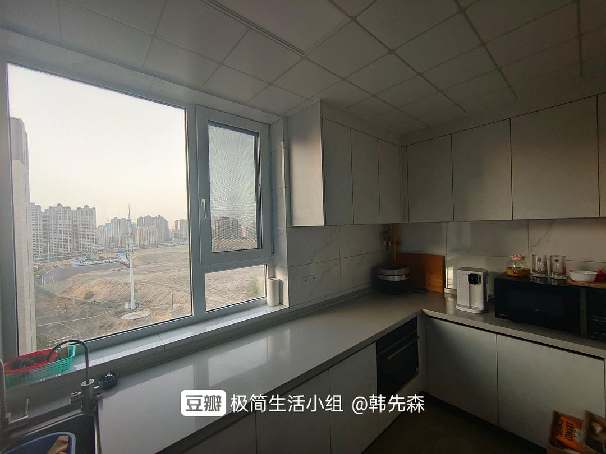

# Home Tour: Two Years of Minimalist Living

*Originally shared by Mr. Han from Urumqi on May 29, 2022*

## Living Experience

After nearly two years of living in this home, I've developed some insights about maintaining a minimalist living space. When I first moved in, I focused on acquiring essential appliances and household items. However, with a principle of maintaining quality without compromising basic needs, I found that subsequent purchasing needs virtually disappeared.

:::info
Key principles followed:
- Purchase only essential items
- Maintain quality standards
- Avoid impulsive buying
- Replace items only when necessary
  :::

## Current Status

:::note
Update (November 19, 2022): Currently in Urumqi, unable to return home for 102 days due to lockdown. Will update photos of other rooms after restrictions are lifted.
:::

## Photo Gallery

:::note
The following images showcase various areas of my minimalist home, demonstrating how essential items can be arranged efficiently while maintaining a clean, uncluttered aesthetic.
:::

*Living room arranged with essential furniture and clean lines*

*Functional kitchen with necessary appliances*

*Minimalist bedroom layout focusing on essentials*

*Smart storage solutions maintaining tidiness*

*Simple dining space arrangement*

*Dedicated work area with minimal distractions*

*Organized entryway keeping clutter at bay*

:::info
Future Goals:
- Maintain current minimalist setup
- Replace only when necessary
- Avoid impulsive purchases
- Continue practicing mindful consumption
  :::
