# Reflections on Minimalism: A Personal Journey

*Originally written by jgdxghfs from Zhejiang on April 27, 2023*

## Understanding Consumerism

### Why Do People Keep Buying?

Since joining the minimalism group, I've noticed many members struggling with minimalism despite wanting to embrace it. This is perfectly understandable - when you own property, have a stable high-paying job, and maintain complex social circles, your life naturally accumulates material possessions that serve as necessary connections to these aspects of life.

:::note
When you find yourself constantly buying things, it often indicates that you've decided to put down roots somewhere. You've more or less convinced yourself that this is where you'll stay permanently. As someone who has lived in three different cities in two years, I somewhat envy that certainty.
:::

## My Journey to Minimalism

### Childhood Origins

As a child, I was a collector - stones, feathers, used pen refills, even snack wrappers. I would clean them with detergent and stick them in a collection book. This continued until my mother threw everything away and scolded me - that's when I started on the path to minimalism (willingly, I might add 🥺).

## Physical Minimalism

### Clothing

My personal approach:
- Only wear black and white clothes
- White clothes are replaced when they yellow
- Discard clothes at first sign of pilling
- One medium-sized box for all clothing

:::info
Best tip for clothing minimalism: If you have any doubts when receiving an item, even slight ones, don't be lazy - return it immediately!
:::

### Bags

Reduced from seven to four essential bags:
1. Professional work bag
2. Cute small bag for basics
3. Leather backpack for laptop
4. Sports bag for travel

:::note
Solution for eliminating small bags: Consider a functional vest with multiple pockets - practical and stylish!
:::

### Personal Care

#### No-Shampoo Movement
- Joined the No-Shampoo community
- Using soapnuts for all cleaning needs:
    - Hand washing
    - Face washing
    - Hair washing
    - Body washing

:::info
Soapnut usage tips:
- Boil then soak for softening
- Use mesh bags for containment
- 13 nuts per batch is sufficient
- Create small batches to prevent spoilage
  :::

### Bedding

Minimal essentials:
- One mattress
- One bedsheet
- Two blankets
- One duvet cover
- One pillow with case
- One sleeping bag

## Digital Minimalism

### Electronics
- Use phone until it stops working
- Avoid tablets and e-readers
- One laptop if necessary
- Utilize cloud storage for backup

## Mental Minimalism

### Hobby Simplification

Focus on hobbies that don't require physical items:
- Reading (digital books)
- Writing
- Activities requiring minimal equipment

:::note
If the format (digital vs. physical) affects your reading ability, it might indicate that you don't really need to read that particular book.
:::

### Social Relationships

My approach to social minimalism:
- New phone number with each relocation
- Fresh WeChat account for new beginnings
- Natural filtering of relationships
- Living in the present moment

:::info
Don't fear losing connections - truly meaningful relationships will naturally persist, and you'll often meet similar souls in new places.
:::

## The Ultimate Minimalism: Mental State

### Anxiety Reduction

My journey from anxiety to peace:
- Learned to let go of perfectionism
- Embraced a more relaxed approach to life
- Understood that most problems have solutions
- Removed myself from anxiety-inducing situations

## Final Thoughts

### Minimalism is Personal

:::important
Key principles to remember:
- Minimize what doesn't serve you
- Keep what brings joy
- Don't blindly follow others' minimalism rules
- Focus on quality of life
- Remember that needs vary by individual
  :::

## Photo Gallery

:::note
The following images illustrate various aspects of minimalist living and practical solutions.
:::

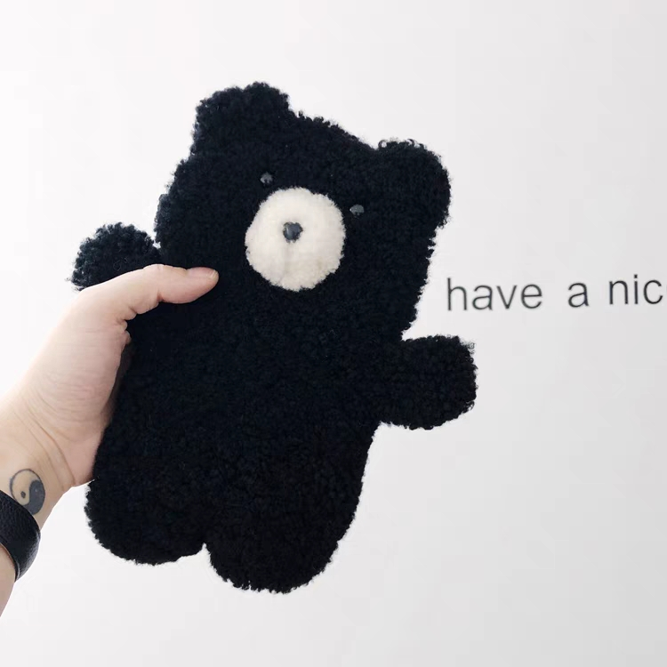
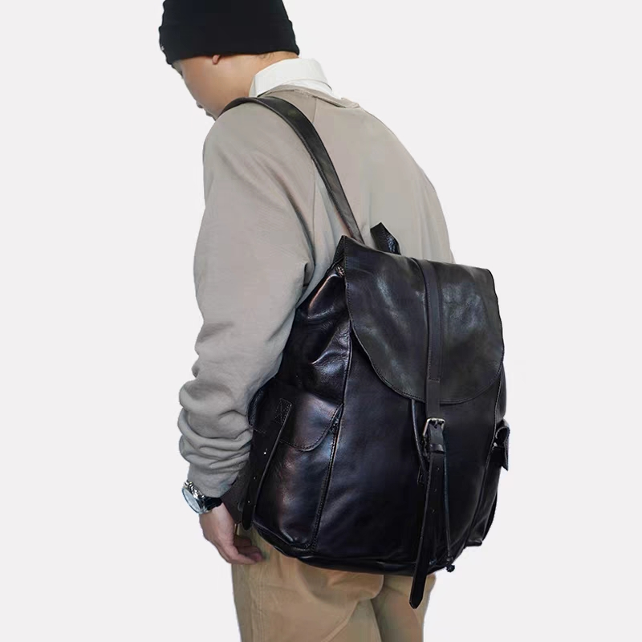
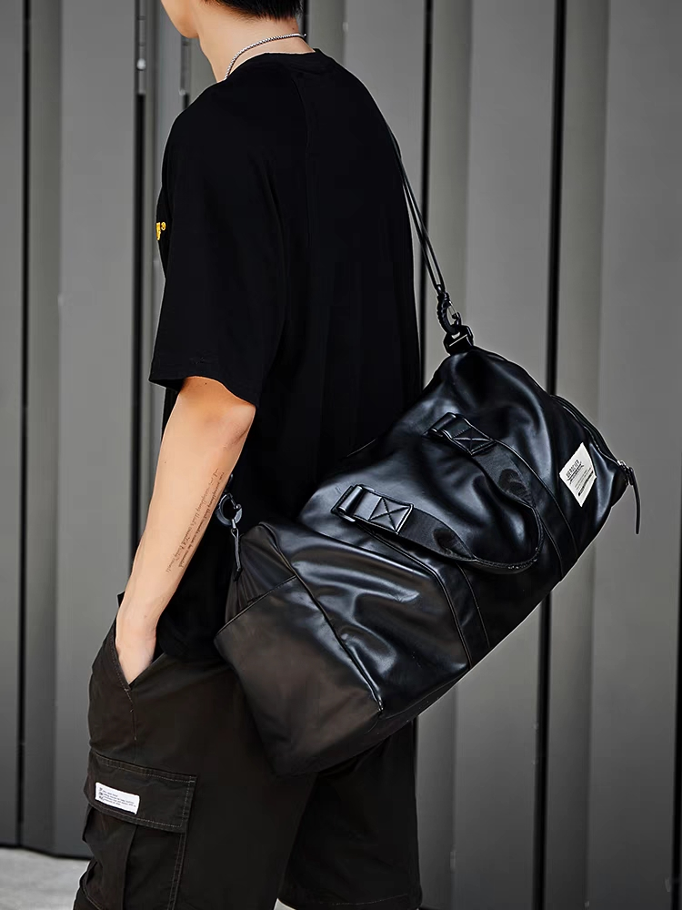
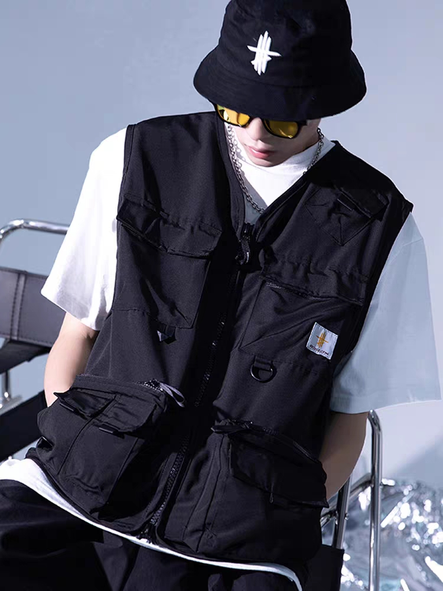

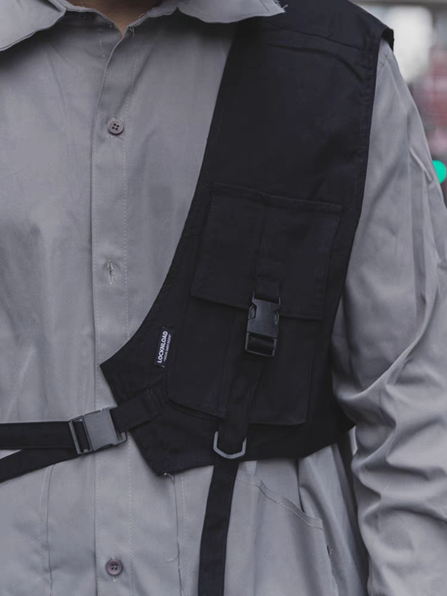
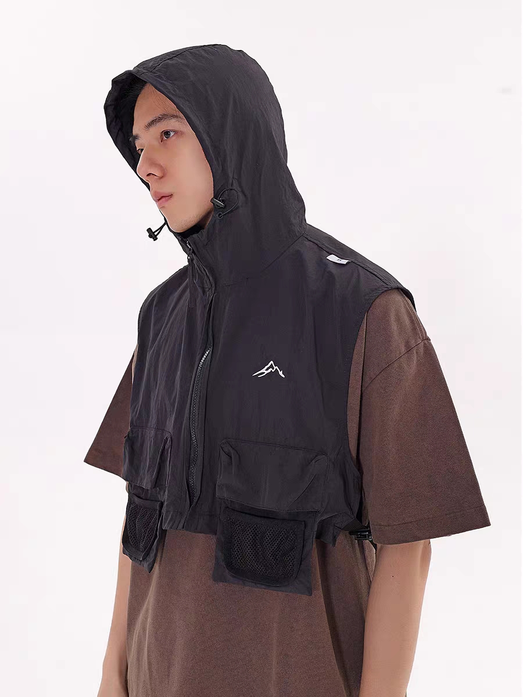
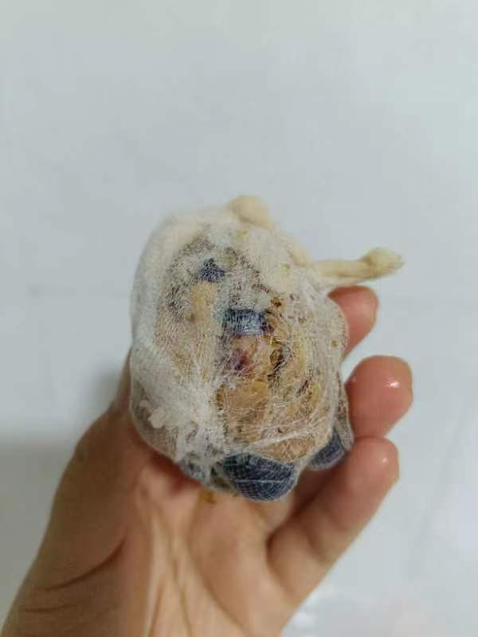
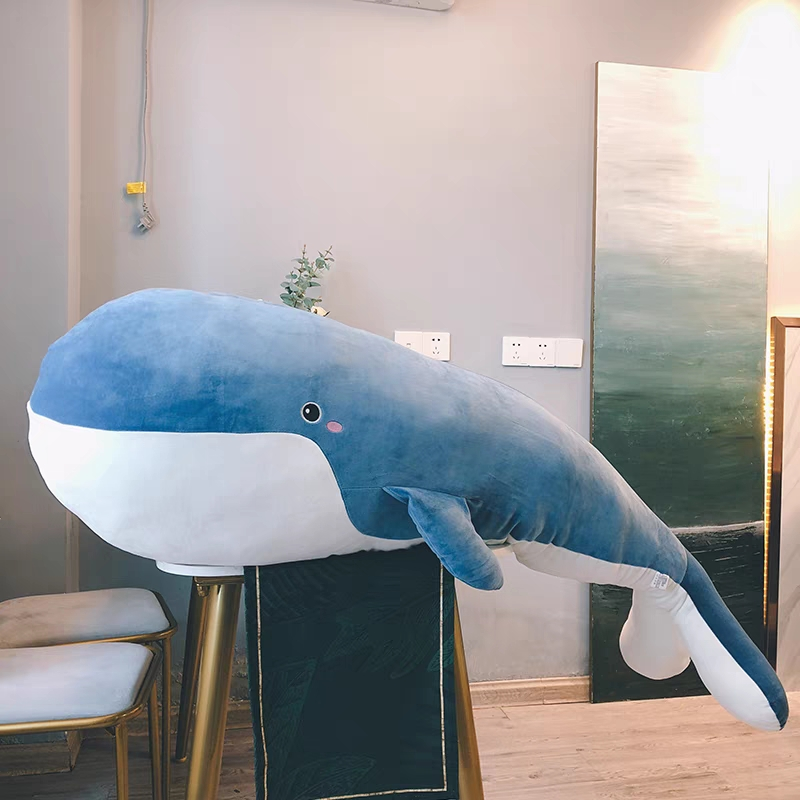
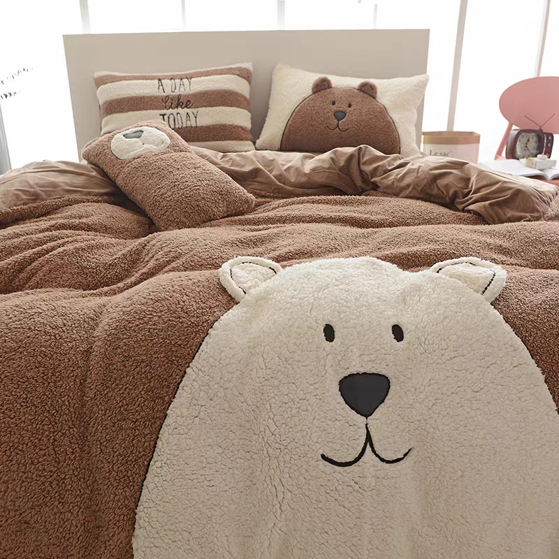
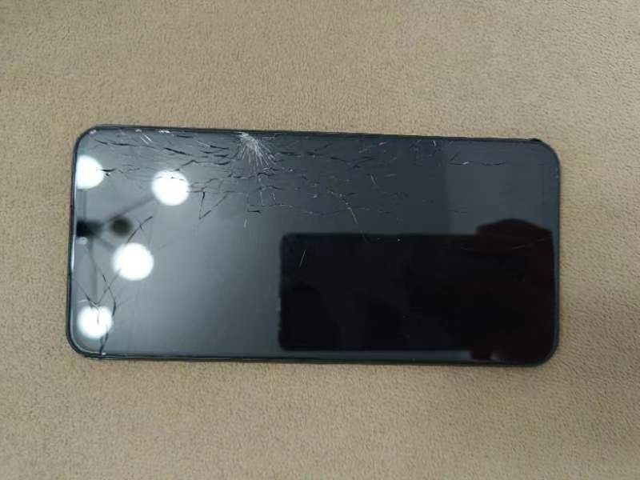
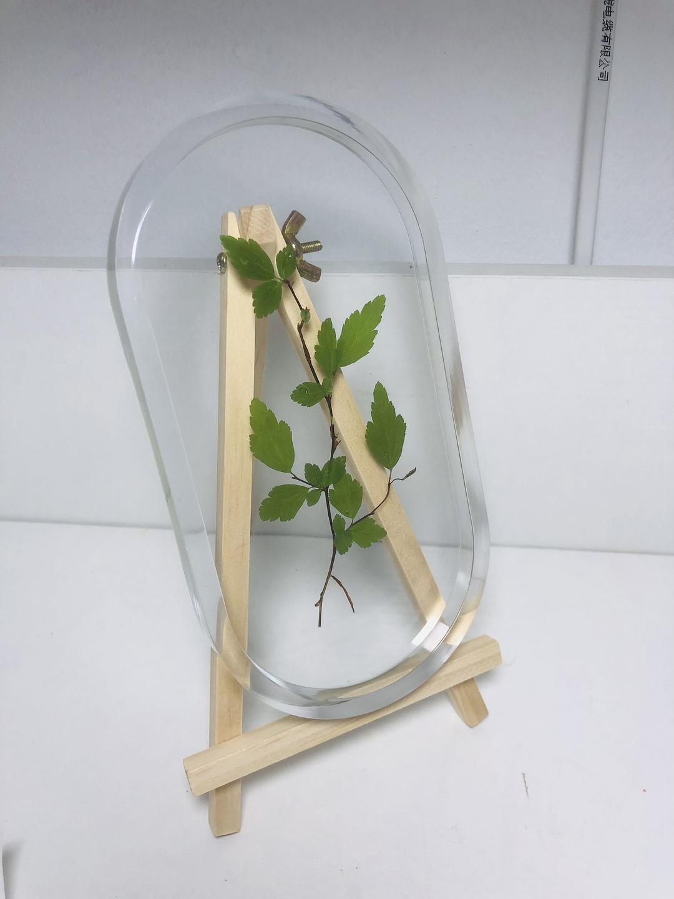
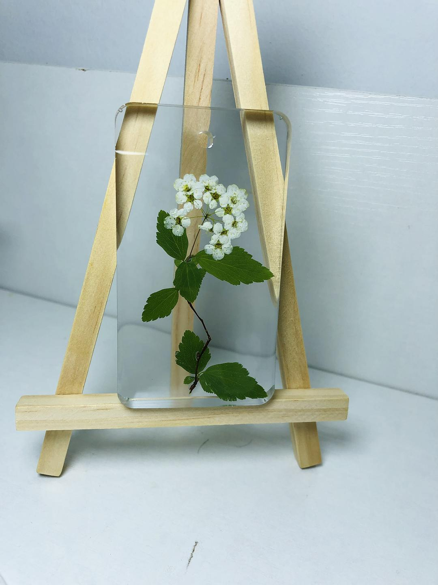
