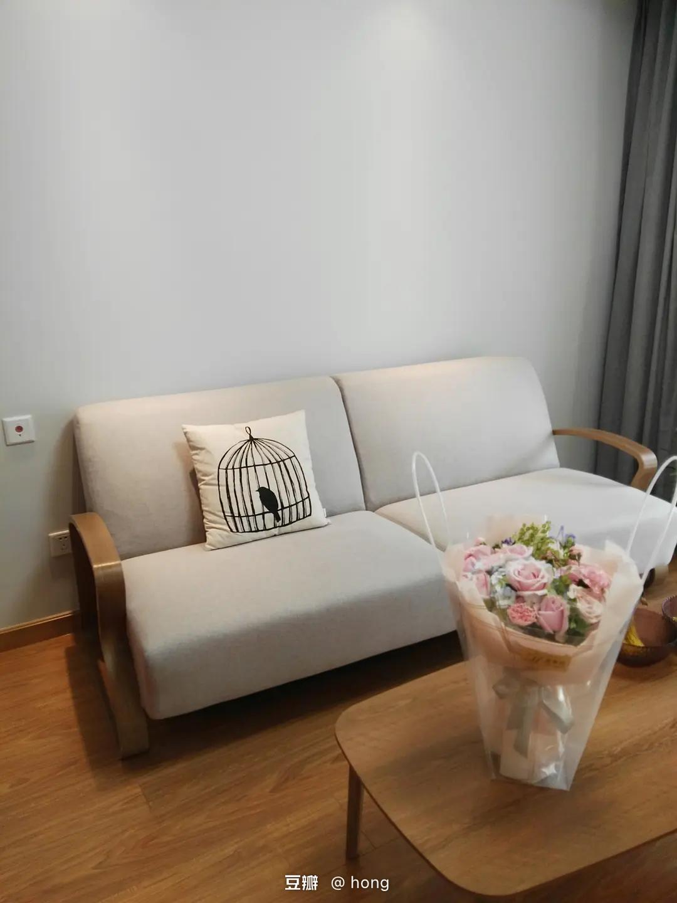
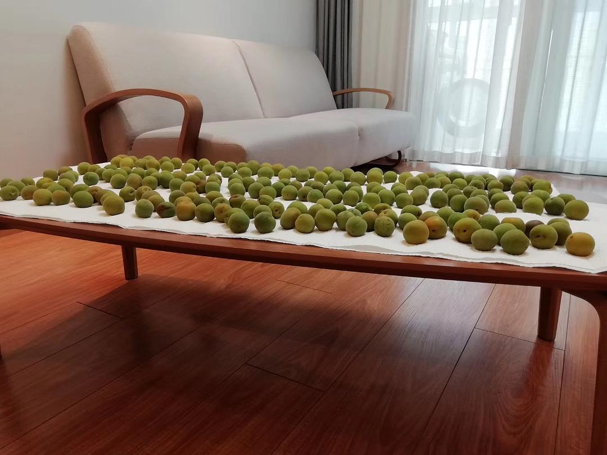

# Our Home of Seven Years

*Originally written by Hong from Jiangsu on May 16, 2023*

## Living Space Evolution

:::note May 18 Update
After receiving overwhelming positive response, I'm sharing more details about our home's evolution over seven years.
:::

## Practical Solutions

### Living Room Adaptations
- Coffee table now stored on desk when not in use
- Storage stools stacked efficiently
- IKEA trolley in sofa corner for:
    - Snacks
    - Water cups
    - Remote controls

:::tip Space Optimization
We initially cleared floor space for the robot vacuum, but ended up preferring this minimalist, clean look.
:::

### Storage Solutions
- Floor-to-ceiling cabinets along walkway
- Uniform storage boxes for categorized organization
- Systematic classification system

### Bedding Philosophy
**Minimalist Approach:**
- Solid colors only
- Fitted sheet style exclusively
- No decorative bedding
- Seasonal silk quilts:
    - Summer: thin layer
    - Spring/Autumn: medium layer
    - Winter: combined layers

### Kitchen Management
:::note Kitchen Reality
The kitchen remains our most challenging space due to varied cookware sizes and shapes. Perfect uniformity would create more visual order, but practicality often wins.
:::

**Weekly Meal Routine:**
- Weekend cooking (chicken or other main dishes)
- Two-day meal rotation
- Alternative options:
    - Local dining
    - Japanese restaurants
    - Noodle soups
    - Hot pot meals
    - Congee days

## Photo Gallery

:::info
The following images document our home's evolution over seven years, showing both the original setup and current adaptations.
:::

