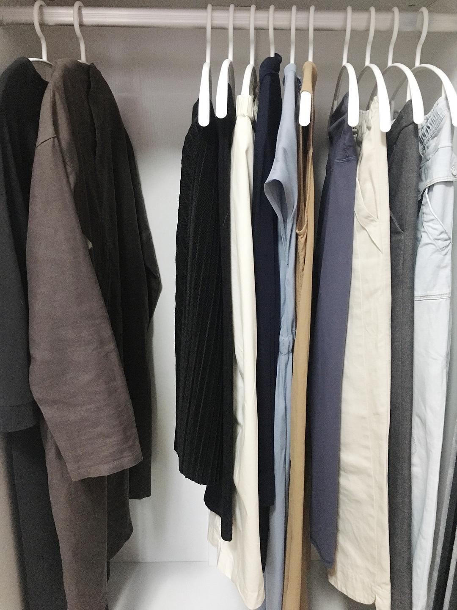

# Six Months of Minimalism: A Proud Achievement

*Originally written by Coco on May 23, 2022*

## Introduction

Today, while organizing my belongings, I couldn't help but feel proud of my achievement in minimalism. The saying "Life at its finest is simple and pure" resonated with me years ago, but only now has it become my chosen lifestyle for the future.

:::info
My Journey Phases:
1. Initial desire to own nothing
2. Guilt with every purchase
3. Current state: Minimal desires, buying only necessities
   :::

## Personal Philosophy

The process has been slow but healing. Minimalism requires time for adaptation, especially for mental preparation. Moving too quickly can lead to rebounds. While some have practiced minimalism for years with refined mindsets, I'm content with my current progress.

:::note
Key Principles:
- "Less is more, slow is fast"
- Comfort in current state is priority
- Minimalism should be diverse for different lifestyles
  :::

## Complete Inventory

### Clothing (35 pieces, excluding loungewear)

#### Outerwear
- Down jackets: 1 long, 1 short, 1 vest
- Wool coats: 2
- Vests: 1
- Leather jacket: 1
- Hoodie: 1
- Shirts: 3
- Knit tops: 3
- Wool sweaters: 2
- T-shirts: 2

#### Bottoms
- Long pants: 3
- Yoga pants: 1
- Athletic shirts: 2
- Athletic shorts: 2
- Thermal underwear: 1

#### Dresses & Skirts
- Winter skirts: 2
- Summer skirts: 1
- Sleeveless dresses: 2
- Long-sleeve dresses: 3

#### Accessories
- Scarf: 1
- Winter hat: 1
- Summer hat: 1
- Swimsuit: 1
- Swim cap: 1
- Sports bras: 2
- Thick leggings: 2
- Thin leggings: 1

### Footwear
- Snow boots: 1
- Boots: 2
- Mules: 1
- Skateboarding shoes: 2
- Athletic shoes: 1

### Bags
- Canvas bags: 2
- Backpack: 1
- Leather bag: 1
- Small crossbody: 1

### Personal Care

#### Skincare & Haircare
- Hair oil: 1
- Facial cleansers: 3 samples
- Sunscreen: 2 small sizes
- Lotion: 1 medium size
- Jojoba oil: 1

#### Makeup
- Foundation: 4 samples
- Eyebrow pencils: 2
- Lipsticks: 1
- Blush: 1
- Lip balm: 1
- Primers: 2
- Setting spray: 1
- Beauty sponge: 1

### Miscellaneous
- Hair clips, bobby pins
- Earrings: 1 pair
- Charging cables
- Card holder: 1
- Headphones: 2 (wireless & wired)
- Books: 32
- Phone tripod: 1
- Mobile phone: 1

### Stock Items
- Makeup remover: 2
- Facial cleanser: 2
- Setting spray: 1
- Face wipes: 4 packs
- Sanitary pads: 15 packs

## Reflections

:::note
The longer I practice minimalism, the more I realize how few things are truly necessary for a fulfilling life.
:::

## Photo Gallery

