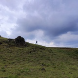
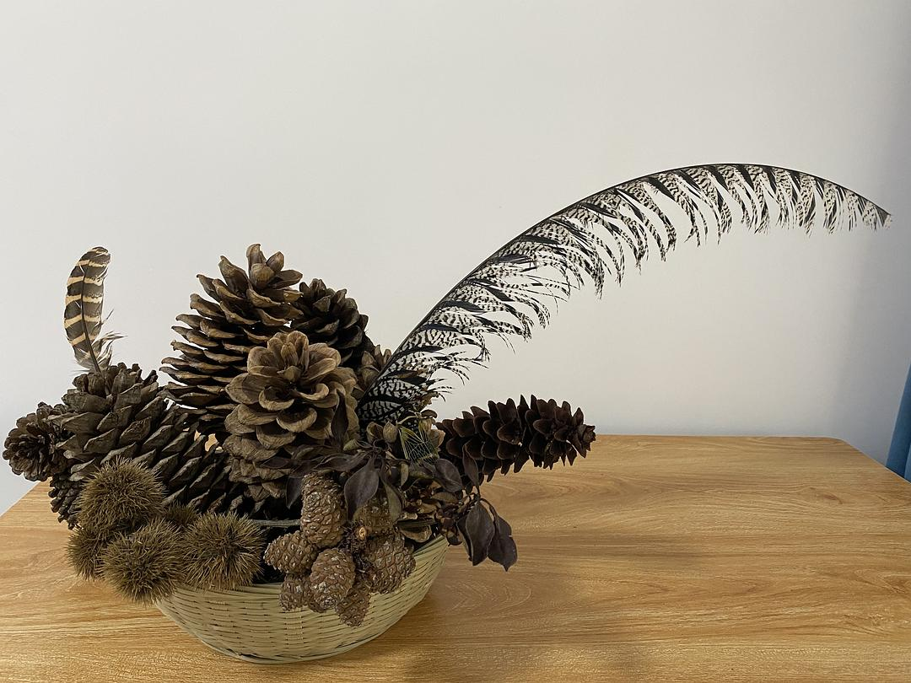
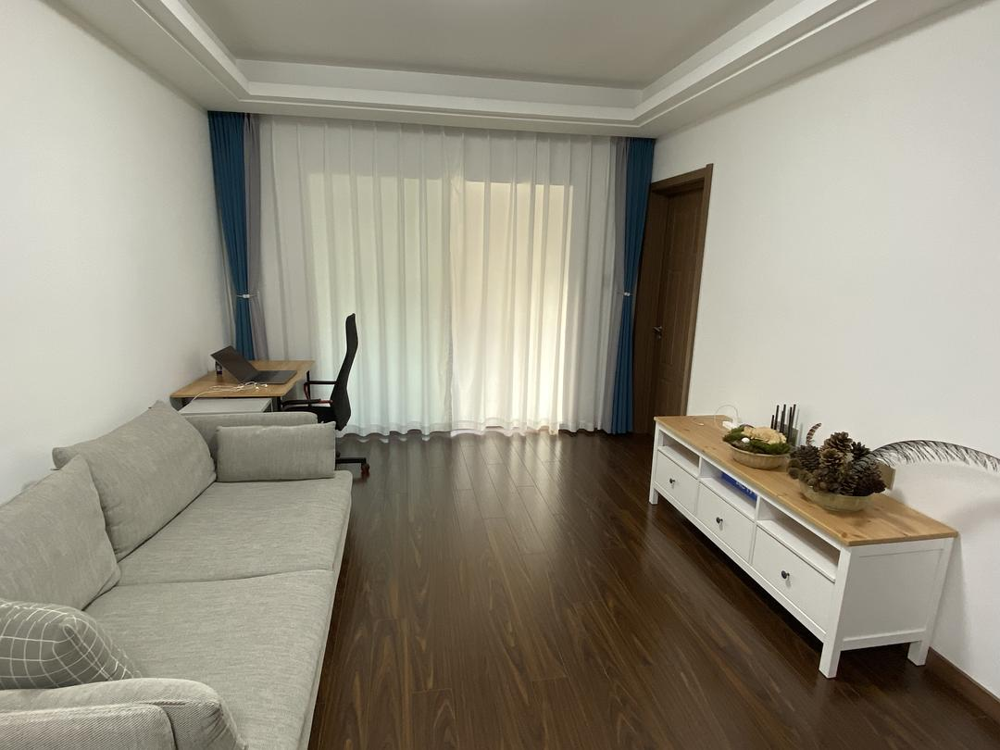
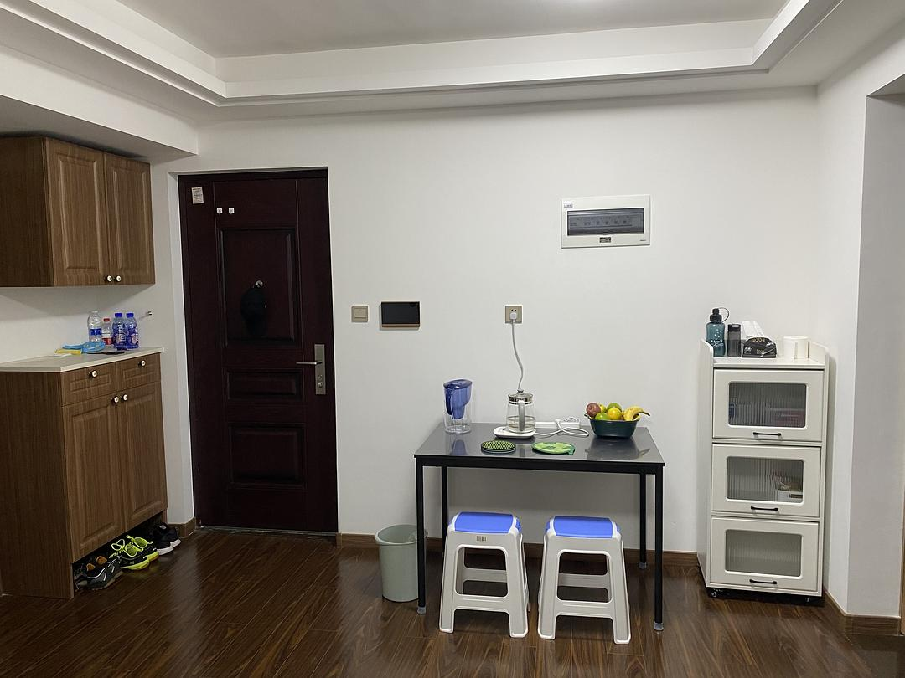
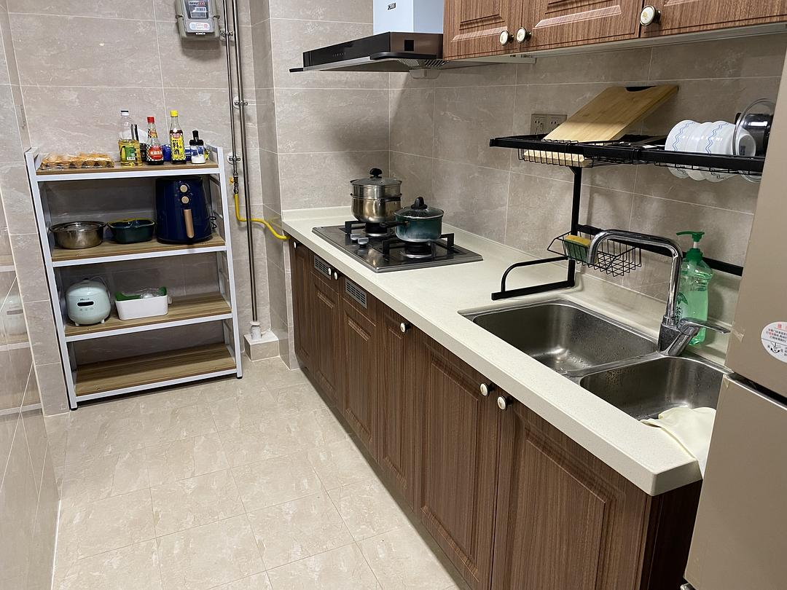
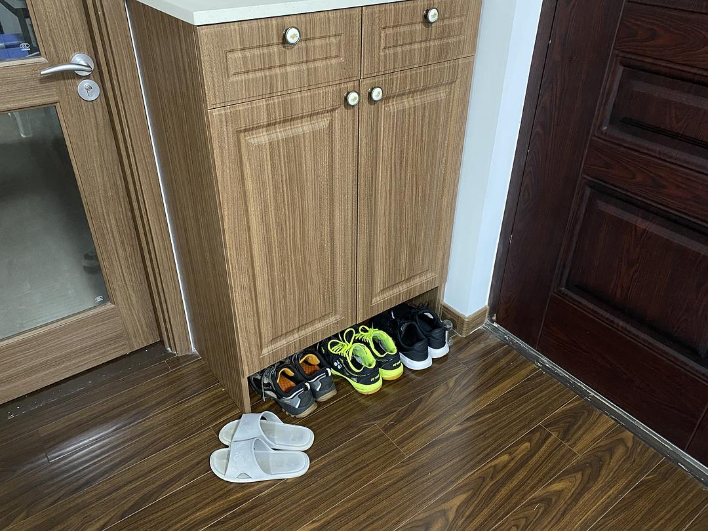
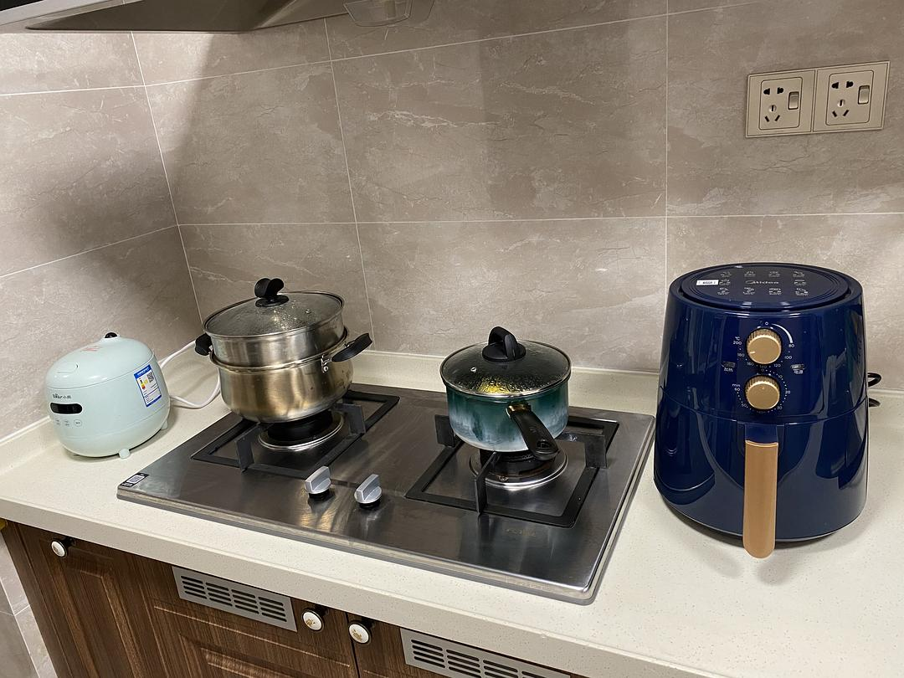
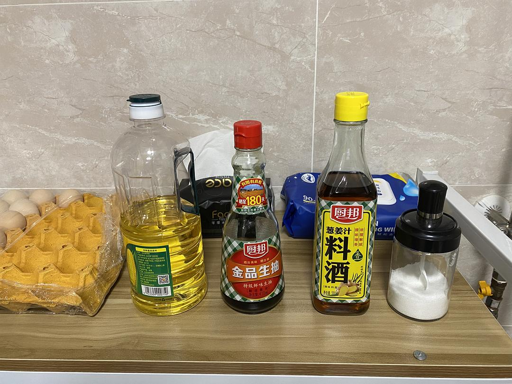
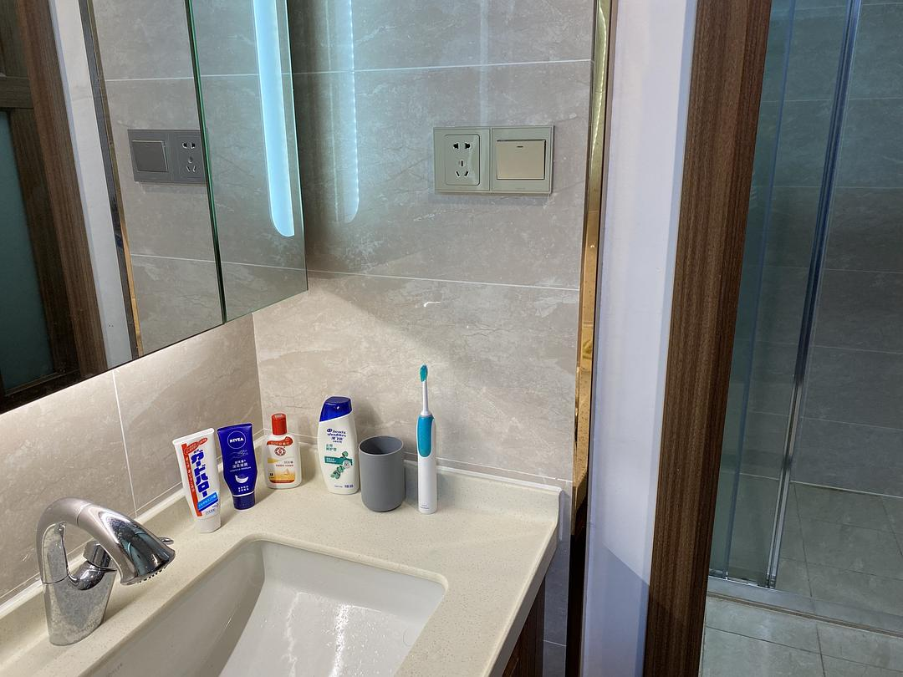
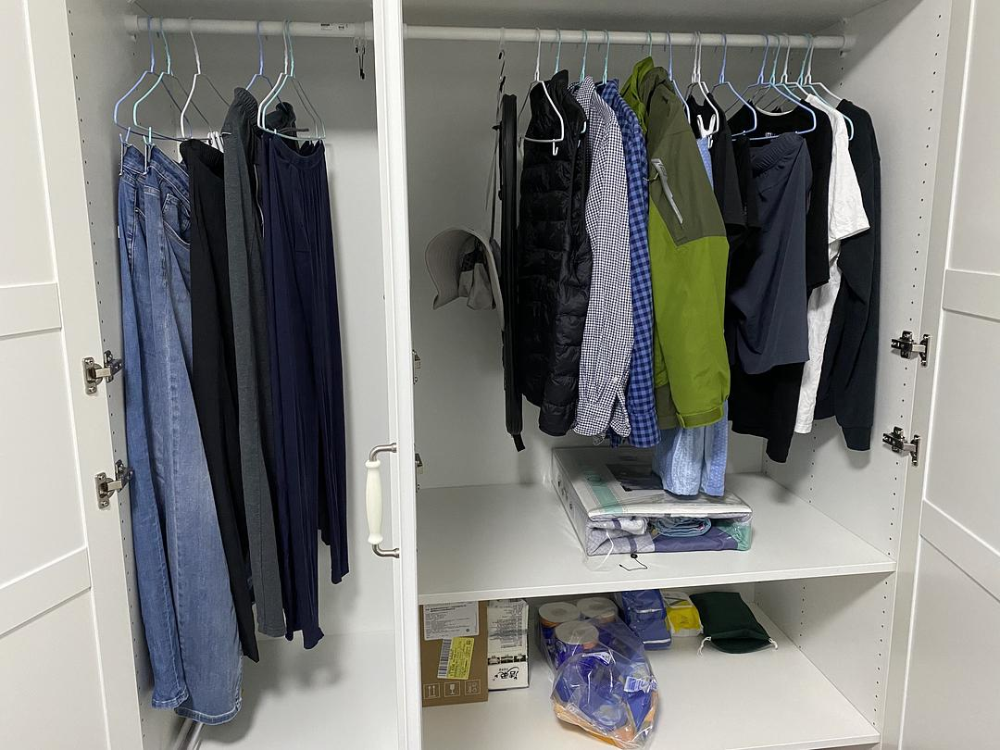

# Minimalist Living: A Solo Dweller's Daily Life

*Originally written by Yitu from Yunnan on October 12, 2023*

## Introduction

I've always been someone who dislikes complications. To me, unnecessary possessions become burdens, so minimalism came naturally. Living alone allows me to pursue this lifestyle without external interference, following my heart's desire. While others might view my lifestyle as austere like a puritan, I find it liberating and comfortable.

## Daily Essentials

### Footwear Philosophy
Four pairs of shoes serve me throughout the year:
- House slippers for indoor use
- Casual shoes for daily outings
- Hiking boots for mountain trails
- Sports shoes for badminton

I replace them only when worn out, maintaining a strict no-redundancy policy.

### Kitchen Minimalism
With no particular culinary demands and an aversion to cooking fumes, I keep cooking simple yet nutritious:

**Cookware Setup:**
- A small cooking pot
- An air fryer
- A rice cooker
- A steamer for reheating

:::note
I've never bought a wok as I don't need one. Vegetables are boiled, meat is air-fried, and soups are made in the rice cooker.
:::

### Meal Planning
**Breakfast:**
- Boiled eggs
- Corn or sweet potatoes
- Milk and fruits

**Lunch:** Light and simple
- Milk and fruits with nuts, or
- Instant oatmeal when at home
- Two steamed buns or McDonald's value meal when out

**Dinner:** The main meal
- Cook once to eat for 2-3 meals
- Only need to cook properly 1-2 times per week

### Nutritional Balance
I maintain a balanced diet through:
- Two eggs daily
- 500ml milk
- Rotating variety of fruits
- Weekly beef or lamb rice noodles
- Regular hiking group dinners
- Occasional friend gatherings
- Vegetarian buffet every 2-3 weeks

### Personal Care
Minimalist skincare and hygiene:
- Simple hairstyle (crew cut)
- Basic moisturizer
- Shampoo only
- Water-only body cleaning due to sensitive skin

## Lifestyle Choices

### Intentional Minimalism
I choose not to have:
- Physical books
- Plants
- Pets

### Benefits of Minimalism

1. **Control and Organization**
    - Every item has its place
    - Can find things even with eyes closed
    - No need for extensive searching

2. **Financial Security**
    - Low daily expenses
    - Reduced pressure to earn excessively
    - Freedom from wealth-pursuit anxiety
    - More composed approach to life

3. **Mental Clarity**
    - Less attachment means more freedom
    - Natural lifestyle rather than forced minimalism
    - Maximum utility from minimum possessions

## Photo Gallery

:::info
The following images showcase a real-world example of minimalist living spaces and personal belongings.
:::

