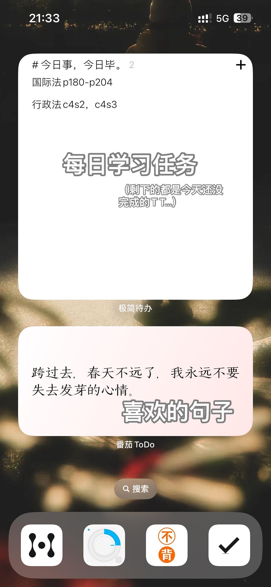
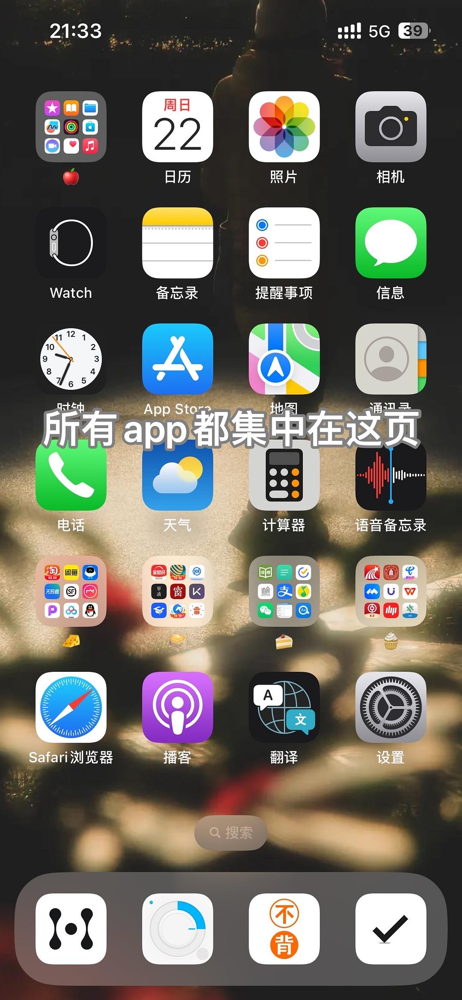
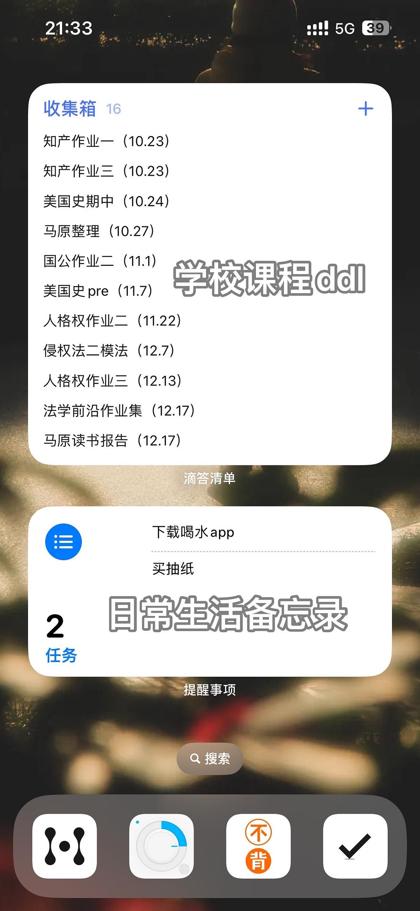
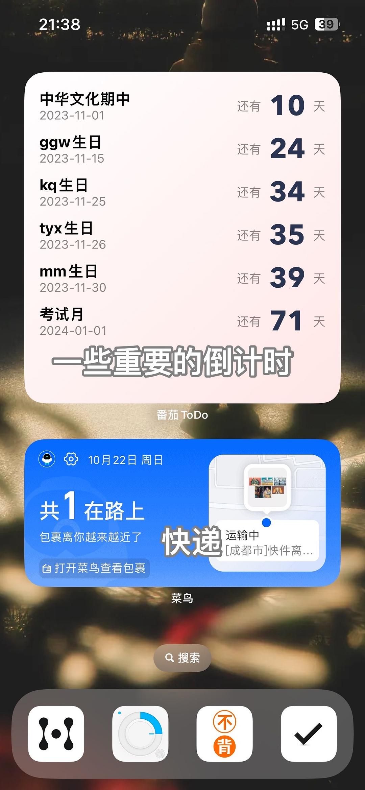
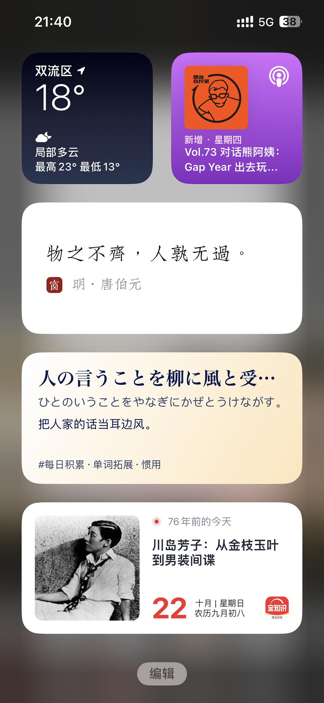

# My Year of Digital Minimalism as a Sophomore

*Originally written by dodo!! on October 11, 2023*

## Introduction

Despite being a heavy internet user in high school, I've managed to embrace a more mindful approach to technology in college. Here's how I've maintained digital minimalism for the past year.

## Core Practices

### 1. Limited Social Media Access
- Only WeChat and QQ on mobile
- Access Douban and Bilibili exclusively through desktop browsers
- No Weibo, Zhihu, Xiaohongshu, or TikTok

:::tip Browser Bookmarks
Using browser bookmarks helps direct access to desired content without algorithmic interference
:::

### 2. Contact Management
- Regular cleanup of inactive contacts
- Systematically block friend feeds
- Set "Do Not Disturb" for all except parents

:::note On Feed Blocking
Individual feed blocking is more effective than completely turning off Moments. While more time-consuming initially, it prevents the temptation to toggle settings back and forth.
:::

### 3. App Simplification
- Enable senior/simplified mode where available
- Use system default apps when possible
- Removed all non-essential features from WeChat and QQ
- Disabled notifications for all apps except messaging

### 4. Physical Device Separation
- No phone in bedroom while sleeping
- Use separate devices for single functions (e.g., MP3 player for music)
- Avoid phone use while walking
- Lock screen reminder: "Stay away from phone when not needed"

### 5. Content Curation
- Regular cleanup of subscribed content
- Follow only high-quality official accounts
- Unfollow commercial accounts after use
- Access school forums only when needed

### 6. Workspace Organization
All apps are organized following these principles:
1. Non-system apps go into folders
2. Most-used apps placed at bottom
3. System apps on desktop
4. Rarely used apps in top-left folder

## Screen Setups

Here are my minimalist phone layouts:

:::info Home Screen Details
The background features street photography from a fellow Douban user. Todo-list widgets help maintain organization despite their simple appearance.
:::

## Additional Tips

### Message Management
- Use WeChat's three-hour first message reminder feature
- Maintain "Do Not Disturb" while staying informed of important messages

### App Organization
- Concentrate all apps on one page
- Group similar apps in folders
- Keep most-used apps easily accessible
- Minimize visible apps on home screen

:::tip Final Thoughts
Digital minimalism isn't about complete abstinence from technology, but rather about creating intentional and meaningful relationships with our digital tools. May we all free ourselves from screen addiction and embrace a more authentic life!
:::
