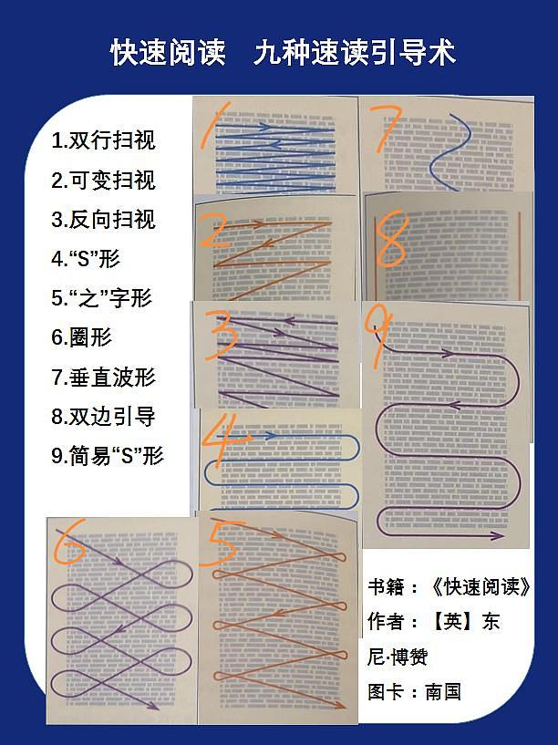

# Improve Your Reading Speed and You Might Start Disliking Videos

*Originally written by Witch Luo's Accordion on January 13, 2023*

## The Reading Advantage

While I've experienced various challenges with digital social media, particularly with text-based platforms like Weibo and Douban, I've rarely found myself addicted to video platforms like TikTok or Bilibili. Recently, through discussions with friends who share my preference for reading over watching videos, I discovered a common understanding: reading allows us to acquire more information in the same amount of time.

:::note
This comparison primarily applies to educational and opinion-based content, not entertainment like cat videos or artistic creations.
:::

## My Speed Reading Journey

In elementary school, I had a fascinating experience attending a "speed reading and memorization" course with my mother. Looking back, it was an integrated approach combining mind mapping techniques, speed reading training, and concentration exercises.

The course's speed reading component followed these fundamental principles:

1. **Silent Reading**
    - Absolutely no vocalization while reading
    - Avoid reading in a recitative manner

2. **Chunking**
    - Focus on sentences and paragraphs as units
    - Scan complete phrases rather than individual words

3. **Intensive Practice**
    - Practice reading entire books in 30-60 minutes
    - Create mind maps of plot points
    - Review for missed details
    - Maps become more comprehensive as reading ability improves

## The Efficiency Argument

While reading speeds vary among individuals, I believe that even relatively slow reading typically delivers higher information density than watching videos. Here's why:

1. **Direct Information Access**
    - Reading allows you to process information at your own pace
    - No need for second-hand explanations

2. **Time Efficiency**
    - You can absorb more content in 5 minutes of reading than in 5 minutes of video
    - Reading eliminates unnecessary filler content

3. **Control and Flexibility**
    - Easy to skim, skip, or reread sections as needed
    - More efficient information retention

:::tip Key Takeaway
While speed reading techniques can enhance your reading efficiency, the most important principle is recognizing that reading generally offers higher information density than video content. Even at a slower reading pace, you're likely absorbing more information than you would from watching videos on the same topic.
:::

*For those interested in learning more about speed reading techniques, I recommend checking out "Speed Reading" on Douban for comprehensive guidance.*
