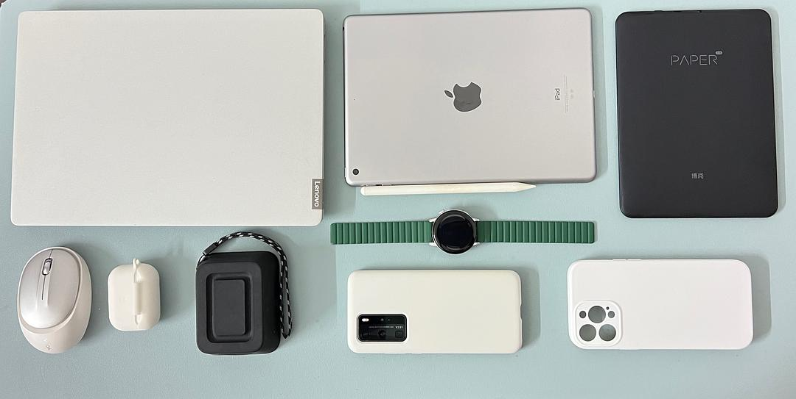
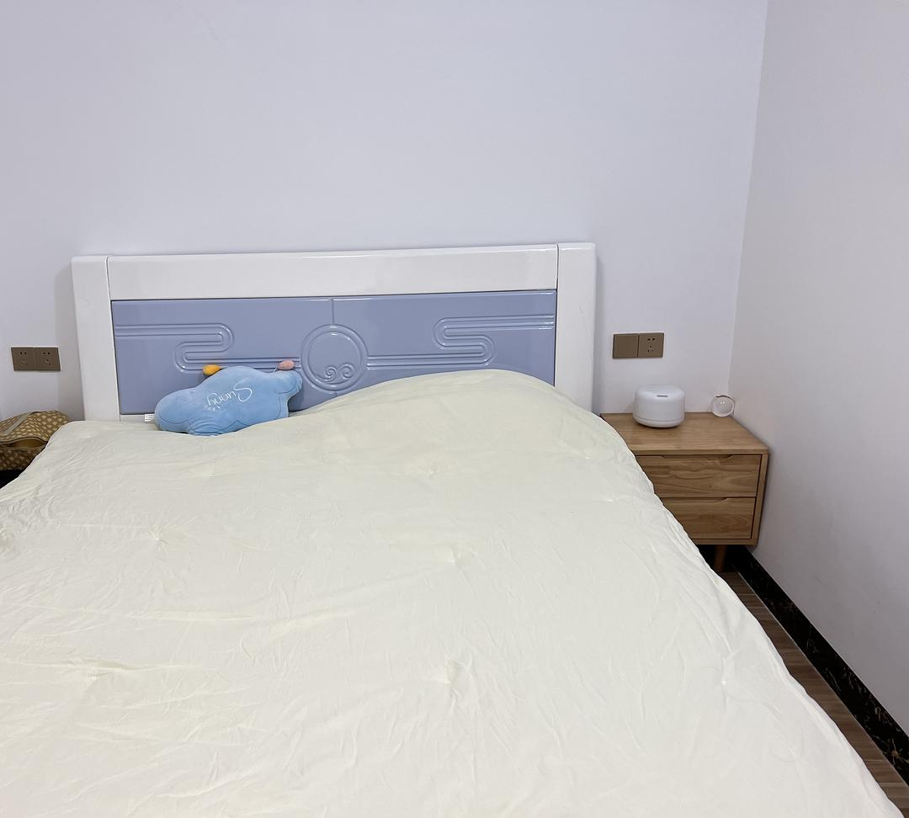

# My Three Years of Minimalist Living

*Originally written by Chocolate Dog Heart from Guangdong on January 19, 2023*

## The Meaning of Minimalist Living

The true measure of a person's wealth isn't just about money or possessions - it's about our intrinsic value when everything else is stripped away. My journey into minimalism wasn't about blindly discarding possessions, but rather about thoughtful organization and meaningful use of items.

:::info
Core principles:
- Anti-consumerism
- Environmental consciousness
- Sustainability
- Personal preference
  :::

## Six Aspects of My Minimalist Life

### 1. My Color Palette

I maintain a strict color scheme of:
- Black
- White
- Gray
- Green
- Blue

:::note
These colors apply to:
- Clothing (minimal, comfort-focused)
- Decorations
- Daily items
- Digital interfaces

The palette is both personally pleasing and practically efficient, eliminating decision fatigue in styling.
:::

### 2. Essential Electronics

Frequently used devices:
1. Laptop
2. iPad
3. Boox e-reader
4. Bluetooth speaker
5. Huawei P40 Pro
6. Huawei Watch GT3
7. iPhone 13 Pro Max
8. Earphones

:::info
As a woman in STEM, I maintain these devices for their practical utility rather than as status symbols.
:::

### 3. Digital Minimalism

Phone management:
- Always on silent mode since middle school
- Essential apps in elderly mode for simplicity
- No notifications enabled
- Regular app cleanup
- Minimal social media usage

### 4. Room Organization

Principles:
- Only daily essentials on desk (tissues, phone, water bottle)
- Everything else stored in cabinets
- Clean, organized spaces

### 5. Focused Interests

Evolution from multiple hobbies to focused pursuits:
- Previously: guitar, ukulele, go, martial arts, dance, soccer, badminton, etc.
- Now: Focused on just two primary interests
- Quality over quantity approach

### 6. Personal Care Items

#### Hair Care
- Shampoo
- Hair dryer
- Hair ties
  (No brush or conditioner)

#### Facial Care
1. HBN skincare set
2. Handmade soap
3. Papaya cream
4. Essential oils
5. Sunscreen (minimal use)
6. Three lipsticks

#### Body Care
1. Handmade soap
2. Towel
3. Perfume

#### Dental Care
1. Retainer
2. Electric toothbrush
3. Toothpaste
4. Dental floss

## Recent Reflection

:::note
A recent travel experience with friends highlighted the contrast between minimalist living and social media-driven lifestyle:
- Friends focused on constant photo-taking
- Excessive social media posting
- Limited real engagement with experiences

This reinforced my commitment to meaningful experiences over digital validation.
:::

## Core Philosophy

Focus on:
- Lifelong learning
- Long-term perspective
- Minimalism
- Creativity
- Contribution

## Photo Gallery

