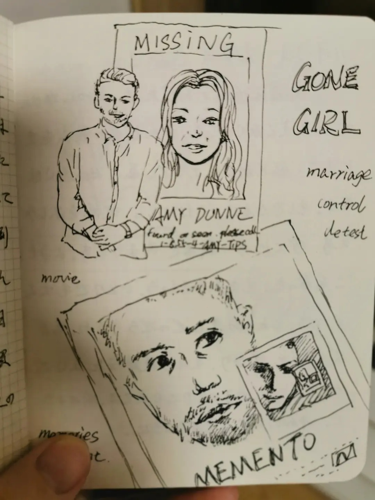
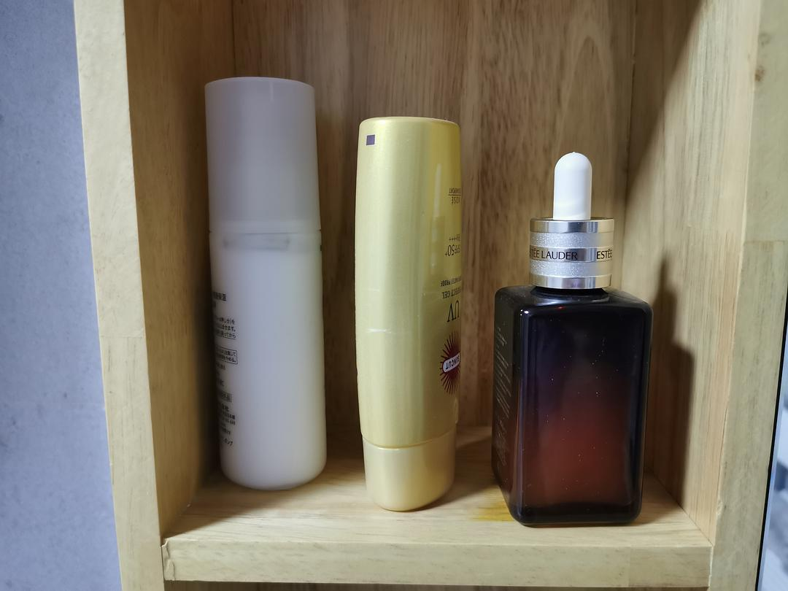

# Year-End Minimalism Review

*Originally written by Sherry from Inner Mongolia on January 4, 2023*

## Quarterly Decluttering Journey

I practice decluttering every quarter - discarding unnecessary items and organizing existing ones. December marked my regular decluttering session, and here's what I removed from my life.

### Books and Notebooks
:::note
Previously, I was reluctant to part with books, but I realized many wouldn't be read again. Local elderly collectors near the community dumpsters will likely recycle them.
:::

**What I Kept:**
- Bookshelf #1: Books I repeatedly reference
- Meaningful childhood sketches
- Japanese study notebooks from N1 preparation
- Selected art journals

**What I Discarded:**
- Unused sketchbooks
- Old language study materials
- Various journals and notebooks

:::info
While these items witnessed my journey from elementary school art to self-studying Japanese and now English, I rarely revisited them. I believe in embracing the present self and letting go of past attachments when necessary.
:::

### Wardrobe Review

**Current Inventory:**
- 30 tops
- 10 pairs of pants
- No dresses/skirts

**Key Insights:**
1. Majority is menswear, which I prefer calling "human wear" - comfortable and practical
2. Discarded uncomfortable women's clothing that:
    - Restricted movement
    - Caused discomfort
    - Exposed midriff
    - Prioritized appearance over comfort

:::note
Living in Northern China with good heating, I wear summer or light spring/autumn clothing indoors, adding just a down jacket for winter outings.
:::

### Skincare Minimalism
My entire skincare routine consists of just three items:
- Lotion
- Sunscreen
- Serum (won't repurchase)

**Philosophy:**
I have oily skin with occasional hormonal breakouts. I've moved past anti-aging concerns, believing that wisdom and knowledge matter more than appearing younger than peers.

### Living Space Optimization

**Recent Changes:**
1. Removed a cat-scratched sofa chair
    - Improved window view and space flow
2. Replaced too-tall bar chairs
    - Custom-ordered appropriate height chairs
    - Revitalized dining area usage

## Reflections on Minimalist Living

### Core Principles
1. **Continuous Assessment**
    - Regular review of possessions
    - Staying sensitive to daily items
    - Appreciating life's subtle beauty

2. **Personal Agency**
    - Prioritizing comfort over appearance
    - Making choices based on personal needs
    - Rejecting societal beauty standards

3. **Focus on Enrichment**
   Last year's achievements:
- Read 43 books
- Played 25 games
- Watched 98 movies

:::quote
As Thoreau said, we should explore our own way of living rather than following our parents' or neighbors' paths.
:::

### Moving Forward
My minimalist journey continues with:
- Reduced material purchases
- Increased focus on intellectual growth
- Regular decluttering sessions

## Photo Gallery

:::info
The following images document my year-end decluttering process and current minimalist setup.
:::

